# 코드 리뷰 가이드

## 변경 이력

| 버전 | 날짜 | 작성자 | 변경 내용 |
|------|------|--------|----------|
| 1.0.0 | 2025-11-25 | @tech-lead | 최초 작성 |

## 관련 문서

- [CONTRIBUTING.md](./CONTRIBUTING.md) - 기여 가이드
- [docs/guides/CLEAN_CODE_GUIDE.md](./docs/guides/CLEAN_CODE_GUIDE.md) - 클린 코드 가이드

---

## 1. 코드 리뷰 목적

```
┌─────────────────────────────────────────────────────────────┐
│                     코드 리뷰의 목적                          │
├─────────────────────────────────────────────────────────────┤
│  ✅ 코드 품질 향상       버그 사전 발견, 최적화 기회 발굴       │
│  ✅ 지식 공유            팀 전체의 코드베이스 이해도 향상        │
│  ✅ 일관성 유지          코딩 스타일 및 패턴 통일               │
│  ✅ 멘토링              주니어 개발자 성장 지원                 │
│  ✅ 책임 분산            한 사람에게 의존하지 않는 시스템        │
├─────────────────────────────────────────────────────────────┤
│  ❌ 게이트키핑 수단으로 사용하지 않음                          │
│  ❌ 개인 스타일 강요 수단으로 사용하지 않음                     │
│  ❌ 비난의 도구로 사용하지 않음                                │
└─────────────────────────────────────────────────────────────┘
```

---

## 2. 리뷰어 체크리스트

### 2.1 필수 확인 항목

```markdown
## 🔴 Critical (반드시 수정)

- [ ] **보안 취약점**: SQL Injection, XSS, CSRF 등 OWASP Top 10
- [ ] **데이터 손실 가능성**: 잘못된 삭제, 덮어쓰기 로직
- [ ] **인증/인가 누락**: 권한 없는 접근 가능성
- [ ] **민감 정보 노출**: API 키, 비밀번호, 개인정보 로깅

## 🟠 Major (강력 권장 수정)

- [ ] **비즈니스 로직 오류**: 요구사항과 다른 구현
- [ ] **성능 문제**: N+1 쿼리, 불필요한 반복, 메모리 누수
- [ ] **테스트 누락**: 핵심 로직에 대한 테스트 없음
- [ ] **에러 처리 누락**: 예외 상황 미처리

## 🟡 Minor (개선 권장)

- [ ] **코드 가독성**: 복잡한 로직, 긴 함수
- [ ] **네이밍**: 의미가 불분명한 변수/함수명
- [ ] **중복 코드**: DRY 원칙 위반
- [ ] **타입 안전성**: any 타입 사용, 타입 가드 누락

## 🟢 Suggestion (선택적 개선)

- [ ] **더 나은 방법 제안**: 대안적인 접근 방식
- [ ] **스타일 개선**: 더 읽기 쉬운 표현
- [ ] **최신 문법**: 더 현대적인 언어 기능 활용
```

### 2.2 영역별 상세 체크

#### 기능 정확성

| 항목 | 확인 질문 |
|------|----------|
| 요구사항 충족 | 이슈/PRD의 요구사항을 모두 구현했는가? |
| 엣지 케이스 | 경계 조건, null/undefined, 빈 배열 등을 처리했는가? |
| 에러 처리 | 모든 실패 시나리오에 적절한 에러 메시지가 있는가? |
| 데이터 무결성 | 트랜잭션이 필요한 곳에 적용되었는가? |

#### 보안

| 항목 | 확인 질문 |
|------|----------|
| 입력 검증 | 사용자 입력이 적절히 검증/새니타이징되는가? |
| 권한 확인 | 리소스 접근 전 권한 확인이 있는가? |
| 민감 데이터 | 비밀번호가 해시되고, 민감 정보가 로그에 남지 않는가? |
| SQL/NoSQL | 쿼리가 파라미터화되어 있는가? |

#### 성능

| 항목 | 확인 질문 |
|------|----------|
| 쿼리 최적화 | N+1 문제가 없는가? 필요한 인덱스가 있는가? |
| 캐싱 | 반복 연산에 캐싱이 적용되어 있는가? |
| 메모리 | 대용량 데이터 처리 시 스트리밍/페이지네이션을 사용하는가? |
| 비동기 처리 | 블로킹 작업이 비동기로 처리되는가? |

#### 테스트

| 항목 | 확인 질문 |
|------|----------|
| 커버리지 | 새 코드에 대한 테스트가 있는가? (80%+ 목표) |
| 테스트 품질 | 테스트가 실제 로직을 검증하는가? (구현 세부사항이 아닌) |
| 엣지 케이스 | 경계 조건, 실패 케이스 테스트가 있는가? |
| 격리 | 테스트가 독립적으로 실행 가능한가? |

#### 코드 품질

| 항목 | 확인 질문 |
|------|----------|
| 단일 책임 | 각 함수/클래스가 하나의 책임만 가지는가? |
| 의존성 | 의존성이 적절히 주입되고 테스트 가능한가? |
| 복잡도 | 중첩이 3단계 이하인가? 함수가 20줄 이하인가? |
| 주석 | 불필요한 주석 없이, 필요한 곳에만 있는가? |

---

## 3. 리뷰 코멘트 작성법

### 3.1 좋은 코멘트의 특징

```markdown
# ✅ GOOD: 구체적, 건설적, 교육적

🔴 [Critical] SQL Injection 취약점
현재 코드:
```python
query = f"SELECT * FROM users WHERE id = {user_id}"
```

`user_id`가 직접 쿼리에 삽입되어 SQL Injection 공격에 취약합니다.

**수정 제안:**
```python
query = "SELECT * FROM users WHERE id = %s"
cursor.execute(query, (user_id,))
```

또는 ORM 사용:
```python
user = session.query(User).filter(User.id == user_id).first()
```

📚 참고: [OWASP SQL Injection Prevention](https://cheatsheetseries.owasp.org/cheatsheets/SQL_Injection_Prevention_Cheat_Sheet.html)
```

```markdown
# ❌ BAD: 모호하고 비건설적

이건 좋지 않아 보입니다.
```

### 3.2 코멘트 접두사 규칙

| 접두사 | 의미 | 예시 |
|--------|------|------|
| `🔴 [Critical]` | 반드시 수정 필요 | 보안 취약점, 크래시 원인 |
| `🟠 [Major]` | 강력히 권장 | 성능 문제, 로직 오류 |
| `🟡 [Minor]` | 개선 권장 | 가독성, 네이밍 |
| `💡 [Suggestion]` | 선택적 제안 | 대안, 더 나은 방법 |
| `❓ [Question]` | 이해 필요 | 의도 확인, 설명 요청 |
| `📝 [Nit]` | 사소한 지적 | 오타, 포맷팅 |
| `👍 [Praise]` | 칭찬 | 좋은 코드, 배울 점 |

### 3.3 칭찬도 중요

```markdown
# 좋은 코드에 대한 칭찬 예시

👍 [Praise] 이 부분 정말 깔끔하게 처리했네요!
특히 에러 케이스를 먼저 처리하고 happy path를 뒤에 두는
guard clause 패턴이 가독성을 크게 높여줍니다.

👍 [Praise] 커스텀 훅으로 분리한 것 좋습니다.
재사용성도 높아지고 컴포넌트가 깔끔해졌어요.
```

---

## 4. 리뷰 받는 사람 가이드

### 4.1 리뷰 요청 전 셀프 체크

```markdown
## 셀프 리뷰 체크리스트

- [ ] 테스트가 모두 통과하는가?
- [ ] 린트/포맷터 에러가 없는가?
- [ ] 불필요한 console.log/print 문을 제거했는가?
- [ ] 주석 처리된 코드를 삭제했는가?
- [ ] 커밋 메시지가 규칙을 따르는가?
- [ ] PR 설명이 충분한가?
- [ ] 스스로 코드를 한번 더 읽어보았는가?
```

### 4.2 피드백에 응답하기

| 상황 | 권장 대응 |
|------|----------|
| 동의하는 경우 | 수정 후 "Fixed" 코멘트 |
| 이미 수정한 경우 | "이미 [커밋 해시]에서 수정했습니다" |
| 동의하지 않는 경우 | 근거와 함께 의견 제시, 토론 |
| 이해가 안 되는 경우 | 추가 설명 요청 |
| 범위 밖인 경우 | 별도 이슈로 등록 제안 |

### 4.3 피드백 수용 자세

```
┌─────────────────────────────────────────────────────────────┐
│                   피드백은 코드에 대한 것                      │
├─────────────────────────────────────────────────────────────┤
│  ✅ "이 코드는 개선이 필요합니다" ≠ "당신은 실력이 부족합니다"    │
│  ✅ 모든 개발자는 실수를 합니다. 리뷰는 그것을 잡는 과정입니다    │
│  ✅ 다른 시각에서의 피드백은 성장의 기회입니다                   │
│  ✅ 질문하는 것은 부끄러운 것이 아닙니다                        │
└─────────────────────────────────────────────────────────────┘
```

---

## 5. 리뷰 프로세스

### 5.1 타임라인

```mermaid
gantt
    title PR 리뷰 타임라인
    dateFormat  HH:mm
    section 작성자
    PR 생성           :a1, 09:00, 15m
    셀프 리뷰         :a2, after a1, 15m
    section 리뷰어
    첫 리뷰 시작      :b1, after a2, 30m
    리뷰 완료         :b2, after b1, 30m
    section 작성자
    피드백 반영       :c1, after b2, 1h
    section 리뷰어
    재리뷰/승인       :d1, after c1, 15m
```



**목표 시간:**
- 첫 리뷰 시작: PR 생성 후 24시간 이내
- 리뷰 완료: PR 생성 후 48시간 이내
- 승인 후 머지: 4시간 이내

### 5.2 리뷰어 배정

```yaml
# .github/CODEOWNERS
# 각 영역별 담당자 지정

# Frontend
/src/frontend/       @frontend-team

# Backend
/src/backend/        @backend-team

# AI/Worker
/src/worker/         @ai-team

# Infrastructure
/infra/              @devops-team
/.github/            @devops-team

# Documentation
/docs/               @all-developers
*.md                 @tech-lead
```

### 5.3 리뷰 우선순위

| 우선순위 | 기준 | 응답 시간 |
|---------|------|----------|
| P0 | 프로덕션 핫픽스 | 1시간 이내 |
| P1 | 블로킹 이슈 해결 | 4시간 이내 |
| P2 | 일반 기능/버그픽스 | 24시간 이내 |
| P3 | 리팩토링, 문서화 | 48시간 이내 |

---

## 6. 특수 상황 처리

### 6.1 대규모 PR

**500줄 이상의 PR은 분할을 권장합니다.**

분할이 어려운 경우:
1. PR 설명에 변경 사항 요약 포함
2. 파일별/영역별 리뷰 순서 제안
3. 핵심 로직 파일 먼저 리뷰 요청

### 6.2 긴급 상황

```markdown
## 핫픽스 리뷰 프로세스

1. PR 제목에 [HOTFIX] 접두사 추가
2. Slack #emergency 채널에 알림
3. 리뷰어 1명 + 테크리드 승인으로 머지 가능
4. 머지 후 48시간 내 추가 리뷰 및 개선
```

### 6.3 의견 충돌

```
┌─────────────────────────────────────────────────────────────┐
│                    의견 충돌 해결 프로세스                     │
├─────────────────────────────────────────────────────────────┤
│  1. 서면으로 각자의 근거 제시                                 │
│  2. 15분 이상 평행선이면 화상/대면 논의                        │
│  3. 합의 안 되면 테크리드 판단 요청                            │
│  4. 결정 사항은 ADR로 문서화                                  │
└─────────────────────────────────────────────────────────────┘
```

---

## 7. 리뷰 품질 지표

### 7.1 측정 지표

| 지표 | 목표 | 측정 방법 |
|------|------|----------|
| 첫 리뷰 시간 | < 24시간 | PR 생성 ~ 첫 코멘트 |
| 리뷰 완료 시간 | < 48시간 | PR 생성 ~ 승인 |
| 리뷰 라운드 | < 3회 | PR당 리뷰 사이클 수 |
| 리뷰 코멘트 수 | 적정 | PR당 평균 코멘트 |

### 7.2 안티패턴

| 안티패턴 | 문제점 | 개선 방법 |
|---------|-------|----------|
| LGTM only | 실질적 리뷰 없음 | 최소 1개 이상 피드백 |
| 지연 리뷰 | 개발 속도 저하 | 리뷰 시간 할당 |
| 과도한 리뷰 | 개발자 피로 | 우선순위 기반 리뷰 |
| 스타일 집착 | 본질 놓침 | 자동화 도구 활용 |

---

## 8. 도구 활용

### 8.1 자동화 체크

```yaml
# CI에서 자동 확인되는 항목
- ESLint / Pylint (린트)
- Prettier / Black (포맷팅)
- TypeScript / mypy (타입 체크)
- Jest / pytest (테스트)
- Codecov (커버리지)
- Snyk / Dependabot (보안)
```

### 8.2 VS Code 확장

- **GitLens**: Git 히스토리, blame 확인
- **GitHub Pull Requests**: IDE에서 PR 리뷰
- **Code Spell Checker**: 오타 검출
- **Error Lens**: 에러 인라인 표시

---

*좋은 코드 리뷰는 팀 전체의 성장을 이끕니다.*
