# SalonMate - 프로젝트 컨텍스트 (Single Source of Truth)

## 변경 이력 (Changelog)

| 버전 | 날짜 | 작성자 | 변경 내용 |
|------|------|--------|----------|
| 1.0.0 | 2025-11-25 | @core-team | 최초 작성 |

## 관련 문서 (Related Documents)

- [README.md](./README.md) - 프로젝트 소개 및 빠른 시작
- [PRD.md](./docs/specs/PRD.md) - 제품 요구사항 문서
- [ARCHITECTURE.md](./docs/specs/ARCHITECTURE.md) - 시스템 아키텍처

---

## 1. 프로젝트 개요

### 1.1 프로젝트명
**SalonMate** (살롱메이트)

### 1.2 한 줄 요약
> 뷰티/살롱 사장님을 위한 AI 기반 통합 마케팅 자동화 플랫폼

### 1.3 핵심 가치 제안
뷰티샵 사장님들이 시술에 집중할 수 있도록, **리뷰 답변**과 **SNS 콘텐츠 생성**을 AI가 자동화합니다.

```
┌─────────────────────────────────────────────────────────────────┐
│                     SalonMate 핵심 가치                          │
├─────────────────────────────────────────────────────────────────┤
│  📝 리뷰 답변 자동화     │  네이버/구글 리뷰에 맞춤형 AI 답변     │
│  📸 SNS 콘텐츠 생성      │  인스타그램 캡션/해시태그 자동 생성    │
│  📊 마케팅 인사이트      │  데이터 기반 마케팅 성과 분석          │
│  💰 비용 절감            │  블로그 대행비 50% 이상 절감           │
└─────────────────────────────────────────────────────────────────┘
```

---

## 2. 비즈니스 컨텍스트

### 2.1 타겟 시장

| 구분 | 내용 |
|------|------|
| **1차 타겟** | 네일샵, 헤어샵, 피부관리샵, 속눈썹/반영구샵 |
| **시장 규모** | 국내 약 15만 개 사업체 |
| **TAM** | 월 10만원 × 15만개 = 월 150억원 |
| **초기 목표** | 6개월 내 유료 고객 100개, MRR 1,000만원 |

### 2.2 페인포인트


**주요 페인포인트:**
1. **리뷰 관리 부담**: 네이버/구글 리뷰 답변에 하루 30분 이상 소요
2. **콘텐츠 병목**: 사진은 많이 찍지만 업로드는 월 수회에 불과
3. **블로그 비용**: 외주 시 월 20~50만원 발생
4. **SEO 지식 부족**: 효과적인 키워드/해시태그 전략 부재

### 2.3 경쟁 환경

| 경쟁사 | 가격 | 강점 | 약점 |
|--------|------|------|------|
| 캐시노트 | 월 3.3만원 | 70만 사용자, 매출 분석 | 마케팅 자동화 없음 |
| 댓글몽 | 월 5~10만원 | 리뷰 답변 특화 | 배달업종 중심 |
| 채널톡 | 월 3.6~13.2만원 | CRM 기능 | SNS/리뷰 기능 없음 |
| 블로그 대행 | 월 20~50만원 | 풀서비스 | 고비용, 품질 편차 |

**SalonMate 차별점:**
- 뷰티 업종 특화 AI (용어, 톤앤매너)
- 네이버 + 구글 + 인스타그램 통합 관리
- 블로그 대행 대비 50% 이상 비용 절감

---

## 3. 제품 범위

### 3.1 MVP 기능 (Phase 1)


| 기능 | 설명 | 우선순위 |
|------|------|----------|
| 구글 리뷰 자동 답변 | Google Business Profile API 연동, AI 답변 자동 게시 | P0 |
| 네이버 리뷰 답변 생성 | AI 답변 생성 → 복사하여 사용 (수동 워크플로우) | P0 |
| 인스타 캡션 생성 | 사진 업로드 → AI 캡션/해시태그 생성 | P0 |
| 인스타 자동 포스팅 | Instagram Graph API 연동, 예약 발행 | P1 |
| 대시보드 | 리뷰/포스팅 현황 모니터링 | P1 |

### 3.2 Phase 2 확장 (PMF 검증 후)

- CRM 통합: 고객별 방문 이력, 선호 시술 관리
- 예약 연동: 네이버/카카오 예약 시스템 연동
- 블로그 콘텐츠 생성: 네이버 블로그 SEO 최적화 글 자동 생성
- 버티컬 확장: 요가/필라테스, 애견샵, 독립 카페

### 3.3 Out of Scope (MVP)

- 배달 플랫폼 연동 (배민/요기요)
- 결제/POS 시스템 통합
- 직원 관리/급여 기능
- 재고 관리

---

## 4. 기술 스택

### 4.1 선정 기준

| 기준 | 가중치 | 설명 |
|------|--------|------|
| **UI/UX 성능** | 높음 | 최소 번들, 빠른 인터랙션 |
| **백엔드 성능** | 높음 | 높은 처리량, 낮은 메모리 |
| **모바일 패키징** | 높음 | 웹 → 앱 전환 용이성 |
| **AI 통합** | 높음 | LangChain 네이티브 지원 |
| **비용 효율** | 높음 | 인프라 비용 최소화 |

### 4.2 기술 스택 결정

```
┌─────────────────────────────────────────────────────────────────┐
│                        FRONTEND                                  │
├─────────────────────────────────────────────────────────────────┤
│  Framework    │  SvelteKit 2.0 (SSR/SSG/SPA)                     │
│  Language     │  TypeScript 5.x                                  │
│  UI Library   │  Svelte 5 (Runes)                                │
│  Styling      │  Tailwind CSS + Skeleton UI                      │
│  Mobile       │  Capacitor (iOS/Android 패키징)                   │
└─────────────────────────────────────────────────────────────────┘

┌─────────────────────────────────────────────────────────────────┐
│                      BACKEND API                                 │
├─────────────────────────────────────────────────────────────────┤
│  Language     │  Go 1.22+                                        │
│  Framework    │  Echo v4 (고성능 HTTP 프레임워크)                  │
│  Database     │  sqlc (타입 안전 SQL)                             │
│  Migration    │  golang-migrate                                  │
│  Task Queue   │  Asynq (Redis 기반)                               │
│  Auth         │  JWT + OAuth 2.0 (Google, Kakao)                 │
└─────────────────────────────────────────────────────────────────┘

┌─────────────────────────────────────────────────────────────────┐
│                      AI WORKER (별도 서비스)                      │
├─────────────────────────────────────────────────────────────────┤
│  Language     │  Python 3.12                                     │
│  Framework    │  LangChain + LangGraph                           │
│  LLM          │  OpenAI GPT-4o (품질 우선)                        │
│  Fallback     │  Claude Haiku / GPT-4o-mini (비용 최적화)         │
│  Embedding    │  OpenAI text-embedding-3-small                   │
│  통신         │  Redis Queue (Asynq) / gRPC                       │
└─────────────────────────────────────────────────────────────────┘

┌─────────────────────────────────────────────────────────────────┐
│                     INFRASTRUCTURE                               │
├─────────────────────────────────────────────────────────────────┤
│  Database     │  Neon PostgreSQL (서버리스)                       │
│  Frontend     │  Vercel / Cloudflare Pages                       │
│  Backend API  │  Fly.io (글로벌 엣지 배포)                        │
│  AI Worker    │  Railway / Modal                                 │
│  Queue/Cache  │  Upstash Redis                                   │
│  Storage      │  Cloudflare R2                                   │
│  CDN          │  Cloudflare                                      │
│  Monitoring   │  Sentry + Grafana Cloud (Free tier)              │
└─────────────────────────────────────────────────────────────────┘
```

### 4.3 기술 선정 근거

#### Frontend: SvelteKit + Tailwind + Skeleton UI
- **최소 번들**: React 대비 60-70% 작은 번들 크기 (30-50KB)
- **빠른 인터랙션**: 제로 런타임 오버헤드, 컴파일 타임 최적화
- **내장 애니메이션**: 부드러운 전환 효과 기본 제공
- **간결한 문법**: 보일러플레이트 최소화, 생산성 향상

#### Backend API: Go (Echo)
- **압도적 성능**: 100,000+ req/s (Python 대비 6-7배)
- **메모리 효율**: 20MB 메모리 (Python 대비 1/6)
- **동시성**: 고루틴 기반 수십만 동시 연결 처리
- **배포 단순화**: 단일 바이너리, 빠른 콜드 스타트 (0.1초)

#### AI Worker: Python (별도 서비스)
- **LangChain 네이티브**: Python이 LangChain 생태계 최적 지원
- **AI 라이브러리**: NumPy, Pandas 등 ML 라이브러리 통합
- **분리된 관심사**: API 성능과 AI 처리 독립적 확장

#### Database: Neon PostgreSQL
- **서버리스**: 자동 스케일링, 사용한 만큼 과금
- **브랜칭**: 개발/스테이징 DB 즉시 생성
- **비용 효율**: 무료 티어로 MVP 검증 가능

---

## 5. 시스템 아키텍처 개요

```mermaid
graph TB
    subgraph Client
        WEB[Web App<br/>SvelteKit]
        IOS[iOS App<br/>Capacitor]
        AND[Android App<br/>Capacitor]
    end

    subgraph Edge Layer
        CF[Cloudflare<br/>CDN + WAF]
    end

    subgraph Application Layer
        FE[SvelteKit<br/>Vercel]
        API[Go API<br/>Fly.io]
        AI[AI Worker<br/>Python]
    end

    subgraph External APIs
        GOOGLE[Google Business<br/>Profile API]
        INSTA[Instagram<br/>Graph API]
        OPENAI[OpenAI<br/>GPT-4o]
    end

    subgraph Data Layer
        DB[(Neon<br/>PostgreSQL)]
        REDIS[(Upstash<br/>Redis)]
        STORAGE[Cloudflare<br/>R2]
    end

    WEB --> CF
    IOS --> CF
    AND --> CF

    CF --> FE
    CF --> API

    FE --> API
    API --> DB
    API --> REDIS
    API --> STORAGE
    API --> AI

    AI --> OPENAI
    AI --> REDIS
    API --> GOOGLE
    API --> INSTA
```



---

## 6. 핵심 성공 지표 (KPIs)

### 6.1 비즈니스 지표 (6개월 목표)

| 지표 | 목표값 | 측정 방법 |
|------|--------|----------|
| 유료 고객 수 | 100개+ | 결제 완료 계정 수 |
| MRR | 1,000만원+ | 월간 반복 매출 |
| 월간 이탈률 | 10% 이하 | 취소 고객 / 전월 고객 |
| NPS | 40+ | 분기별 설문 조사 |

### 6.2 제품 지표

| 지표 | 목표값 | 의미 |
|------|--------|------|
| AI 답변 수정률 | 30% 이하 | AI 품질 검증 |
| 무료→유료 전환율 | 30%+ | PMF 검증 |
| 주간 활성 사용률 | 60%+ | 제품 stickiness |
| 평균 포스팅 증가율 | 3x | 콘텐츠 생성 효과 |

---

## 7. 프로젝트 원칙

### 7.1 개발 원칙

```
┌─────────────────────────────────────────────────────────────────┐
│                      개발 원칙 (Development Principles)           │
├─────────────────────────────────────────────────────────────────┤
│  1. TDD First      테스트 먼저 작성, 코드는 테스트를 통과하기 위해 존재  │
│  2. SDD            모든 코드는 문서화된 스펙에서 파생                  │
│  3. Clean Code     함수 20줄, 클래스 200줄, 파일 400줄 제한          │
│  4. Type Safety    TypeScript strict mode, Pydantic 필수 사용     │
│  5. Security       OWASP Top 10 취약점 사전 방지                   │
└─────────────────────────────────────────────────────────────────┘
```

### 7.2 커뮤니케이션 원칙

| 요소 | 언어 | 예시 |
|------|------|------|
| 문서 내용 | 한국어 | "사용자 인증 서비스를 구현합니다" |
| 코드 주석 | 한국어 | `// 사용자 토큰 검증 로직` |
| 변수/함수명 | English | `userAuthService`, `validateToken()` |
| 커밋 메시지 | English | `feat(auth): add JWT refresh token` |
| API 엔드포인트 | English | `/api/v1/reviews` |

### 7.3 배포 원칙

- **환경 분리**: Development → Staging → Production
- **Feature Flag**: 신규 기능은 플래그로 제어
- **Blue-Green**: 무중단 배포
- **Rollback**: 5분 내 이전 버전 복구 가능

---

## 8. 팀 구조 및 역할

### 8.1 역할 정의

| 역할 | 책임 |
|------|------|
| Product Owner | 요구사항 정의, 우선순위 결정, 고객 피드백 수집 |
| Tech Lead | 아키텍처 결정, 코드 리뷰, 기술 부채 관리 |
| Frontend Dev | 웹/앱 UI 개발, 사용자 경험 최적화 |
| Backend Dev | API 개발, 데이터베이스 설계, 외부 API 연동 |
| AI Engineer | LLM 프롬프트 엔지니어링, AI 파이프라인 개발 |

### 8.2 의사결정 프로세스


---

## 9. 리스크 관리

### 9.1 기술 리스크

| 리스크 | 확률 | 영향 | 대응 전략 |
|--------|------|------|----------|
| 네이버 API 차단 | 중 | 높음 | 구글 중심 피벗, 수동 워크플로우 유지 |
| LLM 비용 초과 | 중 | 중 | 캐싱, 경량 모델 전환, 사용량 제한 |
| 외부 API 장애 | 낮 | 중 | Circuit Breaker, Graceful Degradation |

### 9.2 비즈니스 리스크

| 리스크 | 확률 | 영향 | 대응 전략 |
|--------|------|------|----------|
| 빅테크 진입 | 중 | 높음 | 버티컬 특화로 차별화, 고객 Lock-in |
| 경기 침체 | 중 | 중 | "비용 절감" 가치 제안 강화 |
| PMF 미달성 | 중 | 높음 | 빠른 피벗, 고객 피드백 기반 조정 |

---

## 10. 용어 사전 (Glossary)

| 용어 | 정의 |
|------|------|
| **리뷰 답변율** | 전체 리뷰 중 답변이 작성된 리뷰의 비율 |
| **AI 수정률** | AI 생성 콘텐츠 중 사용자가 수정한 비율 (낮을수록 좋음) |
| **MRR** | Monthly Recurring Revenue, 월간 반복 매출 |
| **PMF** | Product-Market Fit, 제품-시장 적합성 |
| **ARPU** | Average Revenue Per User, 사용자당 평균 매출 |
| **NPS** | Net Promoter Score, 순추천고객지수 |
| **WAU** | Weekly Active Users, 주간 활성 사용자 |

---

## 11. 연락처 및 리소스

### 11.1 주요 링크

| 리소스 | URL |
|--------|-----|
| GitHub Repository | [TBD] |
| Design System (Figma) | [TBD] |
| API Documentation | [TBD] |
| Monitoring Dashboard | [TBD] |

### 11.2 외부 서비스 문서

| 서비스 | 문서 링크 |
|--------|----------|
| Google Business Profile API | https://developers.google.com/my-business |
| Instagram Graph API | https://developers.facebook.com/docs/instagram-api |
| OpenAI API | https://platform.openai.com/docs |
| Supabase | https://supabase.com/docs |

---

*이 문서는 프로젝트의 Single Source of Truth로서 모든 의사결정의 기준이 됩니다.*
*변경 시 반드시 버전을 업데이트하고 팀에 공유해주세요.*
