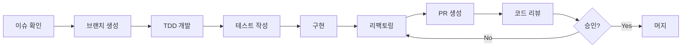

# 기여 가이드 (Contributing Guide)

SalonMate 프로젝트에 기여해 주셔서 감사합니다! 이 문서는 효율적인 협업을 위한 가이드라인을 제공합니다.

## 변경 이력

| 버전 | 날짜 | 작성자 | 변경 내용 |
|------|------|--------|----------|
| 1.0.0 | 2025-11-25 | @tech-lead | 최초 작성 |

## 관련 문서

- [CODE_REVIEW_GUIDE.md](./CODE_REVIEW_GUIDE.md) - 코드 리뷰 가이드
- [VERSIONING_GUIDE.md](./VERSIONING_GUIDE.md) - 버전 관리 가이드
- [docs/guides/TDD_GUIDE.md](./docs/guides/TDD_GUIDE.md) - TDD 가이드

---

## 1. 개발 프로세스

### 1.1 전체 플로우



### 1.2 단계별 설명

1. **이슈 확인**: GitHub Issues에서 작업할 이슈 선택
2. **브랜치 생성**: 이슈 번호 기반 브랜치 생성
3. **TDD 개발**: 테스트 먼저 작성 → 구현 → 리팩토링
4. **PR 생성**: 충분한 설명과 함께 Pull Request 생성
5. **코드 리뷰**: 최소 1명의 리뷰어 승인 필요
6. **머지**: 승인 후 develop 브랜치로 머지

---

## 2. 브랜치 전략

### 2.1 브랜치 구조

```
main              # 프로덕션 배포 브랜치
├── develop       # 개발 통합 브랜치
│   ├── feature/* # 기능 개발
│   ├── bugfix/*  # 버그 수정
│   └── refactor/*# 리팩토링
├── release/*     # 릴리스 준비
└── hotfix/*      # 긴급 수정
```

### 2.2 브랜치 네이밍 규칙

```bash
# 형식
<type>/<issue-number>-<short-description>

# 예시
feature/123-add-google-review-api
bugfix/456-fix-token-refresh
refactor/789-extract-auth-service
hotfix/101-critical-security-fix
```

### 2.3 브랜치 생성

```bash
# develop에서 feature 브랜치 생성
git checkout develop
git pull origin develop
git checkout -b feature/123-add-google-review-api

# 작업 완료 후 push
git push -u origin feature/123-add-google-review-api
```

---

## 3. 커밋 규칙

### 3.1 커밋 메시지 형식

```
<type>(<scope>): <subject>

[optional body]

[optional footer]
```

### 3.2 Type 종류

| Type | 설명 | 예시 |
|------|------|------|
| `feat` | 새로운 기능 | `feat(review): add AI response generation` |
| `fix` | 버그 수정 | `fix(auth): resolve token expiration issue` |
| `docs` | 문서 변경 | `docs(readme): update installation guide` |
| `style` | 코드 포맷팅 (로직 변경 없음) | `style(api): apply black formatter` |
| `refactor` | 리팩토링 (기능 변경 없음) | `refactor(user): extract validation logic` |
| `test` | 테스트 추가/수정 | `test(review): add edge case tests` |
| `chore` | 빌드/설정 변경 | `chore(deps): upgrade fastapi to 0.109` |
| `perf` | 성능 개선 | `perf(query): optimize review list query` |
| `ci` | CI/CD 변경 | `ci(github): add security scan workflow` |

### 3.3 Scope 종류

| Scope | 설명 |
|-------|------|
| `auth` | 인증/인가 |
| `review` | 리뷰 관리 |
| `instagram` | 인스타그램 연동 |
| `ai` | AI/LLM 기능 |
| `api` | API 일반 |
| `ui` | UI 컴포넌트 |
| `db` | 데이터베이스 |
| `config` | 설정 |
| `deps` | 의존성 |

### 3.4 좋은 커밋 메시지 예시

```bash
# ✅ GOOD
feat(review): add Google Business Profile API integration

- Implement review fetching from Google API
- Add retry logic with exponential backoff
- Store reviews in PostgreSQL database

Closes #123

# ✅ GOOD
fix(auth): resolve race condition in token refresh

The token refresh endpoint was susceptible to race conditions
when multiple requests arrived simultaneously. Added mutex lock
to prevent duplicate token generation.

Fixes #456

# ❌ BAD
update code

# ❌ BAD
feat: add stuff
```

### 3.5 커밋 분리 원칙

```
┌─────────────────────────────────────────────────────────────┐
│  하나의 커밋 = 하나의 논리적 변경                              │
├─────────────────────────────────────────────────────────────┤
│  ✅ 기능 추가와 테스트는 같은 커밋                             │
│  ✅ 리팩토링은 별도 커밋                                      │
│  ❌ 기능 변경과 포맷팅을 같은 커밋에 포함하지 않음               │
│  ❌ 여러 이슈를 하나의 커밋으로 해결하지 않음                    │
└─────────────────────────────────────────────────────────────┘
```

---

## 4. Pull Request 가이드

### 4.1 PR 생성 전 체크리스트

- [ ] 테스트가 모두 통과하는가?
- [ ] 린트 에러가 없는가?
- [ ] 코드 커버리지가 기준(80%)을 충족하는가?
- [ ] 불필요한 console.log/print 문을 제거했는가?
- [ ] 커밋 메시지가 규칙을 따르는가?

### 4.2 PR 템플릿

```markdown
## 개요
<!-- 이 PR이 해결하는 문제나 추가하는 기능을 설명해주세요 -->

## 변경 사항
<!-- 주요 변경 사항을 bullet point로 나열해주세요 -->
-

## 테스트
<!-- 테스트 방법을 설명해주세요 -->
- [ ] 단위 테스트 추가/수정
- [ ] 통합 테스트 추가/수정
- [ ] 수동 테스트 완료

## 스크린샷 (UI 변경 시)
<!-- UI 변경이 있다면 스크린샷을 첨부해주세요 -->

## 체크리스트
- [ ] 테스트 통과
- [ ] 린트 통과
- [ ] 문서 업데이트 (필요시)
- [ ] Breaking change 없음

## 관련 이슈
Closes #이슈번호
```

### 4.3 PR 크기 가이드라인

| PR 크기 | 변경 라인 수 | 리뷰 시간 | 권장 |
|---------|-------------|----------|------|
| XS | < 50 | < 15분 | ⭐ |
| S | 50-200 | 15-30분 | ⭐ |
| M | 200-500 | 30-60분 | ⚠️ |
| L | 500-1000 | 1-2시간 | ❌ 분할 권장 |
| XL | > 1000 | > 2시간 | ❌ 반드시 분할 |

### 4.4 PR 머지 조건

1. **리뷰어 승인**: 최소 1명의 승인
2. **CI 통과**: 모든 자동화 체크 통과
3. **충돌 해결**: base 브랜치와 충돌 없음
4. **스쿼시 머지**: feature 브랜치는 스쿼시 머지 사용

```bash
# 머지 시 커밋 메시지 형식
feat(review): add Google review integration (#123)

* Add API client for Google Business Profile
* Implement review sync scheduler
* Add database models and migrations
```

---

## 5. 코드 스타일

### 5.1 Frontend (TypeScript/React)

```typescript
// ✅ GOOD: 명확한 타입, 의미있는 이름
interface ReviewCardProps {
  review: Review;
  onReply: (reviewId: string, content: string) => Promise<void>;
  isLoading?: boolean;
}

export function ReviewCard({ review, onReply, isLoading = false }: ReviewCardProps) {
  // 컴포넌트 로직을 커스텀 훅으로 분리
  const { replyContent, handleSubmit, isSubmitting } = useReviewReply(review.id, onReply);

  return (
    <Card className="p-4">
      {/* 컴포넌트 내용 */}
    </Card>
  );
}
```

### 5.2 Backend (Python)

```python
# ✅ GOOD: 타입 힌트, 독스트링, 의미있는 이름
from typing import Optional
from pydantic import BaseModel


class ReviewResponse(BaseModel):
    """리뷰 답변 응답 모델"""

    id: str
    content: str
    created_at: datetime


async def generate_review_response(
    review_id: str,
    tone: Optional[str] = "friendly"
) -> ReviewResponse:
    """AI를 사용하여 리뷰 답변을 생성합니다.

    Args:
        review_id: 답변을 생성할 리뷰의 ID
        tone: 답변 톤 (friendly, professional, casual)

    Returns:
        생성된 리뷰 답변

    Raises:
        ReviewNotFoundError: 리뷰를 찾을 수 없는 경우
        AIGenerationError: AI 생성 실패 시
    """
    # 구현 로직
```

### 5.3 코드 제한 사항

| 항목 | 제한 | 이유 |
|------|------|------|
| 함수 길이 | 20줄 이하 | 단일 책임 원칙 |
| 클래스 길이 | 200줄 이하 | 응집도 유지 |
| 파일 길이 | 400줄 이하 | 관리 용이성 |
| 중첩 깊이 | 3단계 이하 | 복잡도 제어 |
| 매개변수 수 | 4개 이하 | 인터페이스 단순화 |

---

## 6. 테스트 가이드

### 6.1 테스트 네이밍

```python
# 형식: test_should_<expected>_when_<condition>

# ✅ GOOD
def test_should_return_generated_response_when_valid_review_provided():
    pass

def test_should_raise_error_when_review_not_found():
    pass

# ❌ BAD
def test_review():
    pass

def test_1():
    pass
```

### 6.2 테스트 구조 (AAA 패턴)

```python
def test_should_create_user_when_valid_data_provided():
    # Arrange (준비)
    user_data = UserCreateRequest(
        email="test@example.com",
        password="SecurePassword123!"
    )

    # Act (실행)
    result = user_service.create_user(user_data)

    # Assert (검증)
    assert result.email == "test@example.com"
    assert result.id is not None
```

### 6.3 커버리지 목표

```
┌─────────────────────────────────────────────────────────────┐
│                    테스트 커버리지 목표                        │
├─────────────────────────────────────────────────────────────┤
│  단위 테스트           │  ████████████████████  80%+         │
│  통합 테스트           │  ████████████          60%+         │
│  E2E 테스트            │  Critical Path 100%                │
└─────────────────────────────────────────────────────────────┘
```

---

## 7. 이슈 관리

### 7.1 이슈 라벨

| 라벨 | 색상 | 용도 |
|------|------|------|
| `bug` | 🔴 red | 버그 리포트 |
| `feature` | 🟢 green | 새 기능 요청 |
| `enhancement` | 🔵 blue | 기존 기능 개선 |
| `documentation` | 🟡 yellow | 문서 관련 |
| `good first issue` | 🟣 purple | 입문자 추천 |
| `priority: high` | 🟠 orange | 높은 우선순위 |
| `priority: low` | ⚪ gray | 낮은 우선순위 |

### 7.2 이슈 템플릿

**버그 리포트:**
```markdown
## 버그 설명
<!-- 버그에 대한 명확한 설명 -->

## 재현 단계
1.
2.
3.

## 예상 동작
<!-- 예상했던 정상 동작 -->

## 실제 동작
<!-- 실제로 발생한 동작 -->

## 환경
- OS:
- Browser:
- Version:
```

---

## 8. 보안 가이드라인

### 8.1 절대 커밋하면 안 되는 것

- API 키, 시크릿
- 비밀번호, 토큰
- .env 파일
- 개인정보가 포함된 데이터
- 인증서 파일 (.pem, .key)

### 8.2 민감 정보 발견 시

1. 즉시 해당 시크릿 무효화
2. 새로운 시크릿 발급
3. git history에서 제거 (BFG Repo-Cleaner 사용)
4. 팀에 보고

### 8.3 보안 취약점 리포트

보안 취약점은 공개 이슈로 등록하지 마세요.
[security@salonmate.kr](mailto:security@salonmate.kr)로 비공개 리포트 부탁드립니다.

---

## 9. 커뮤니케이션

### 9.1 질문하기

- **간단한 질문**: Slack #dev-questions 채널
- **기술 토론**: GitHub Discussions
- **버그 리포트**: GitHub Issues

### 9.2 응답 기대 시간

| 채널 | 응답 시간 |
|------|----------|
| Slack 긴급 | 1시간 이내 |
| Slack 일반 | 24시간 이내 |
| GitHub Issues | 48시간 이내 |
| PR 리뷰 | 24시간 이내 |

---

## 10. 감사합니다!

SalonMate는 여러분의 기여로 성장합니다. 궁금한 점이 있으면 언제든지 질문해 주세요.

**First-time contributor?** `good first issue` 라벨이 붙은 이슈부터 시작해보세요!
