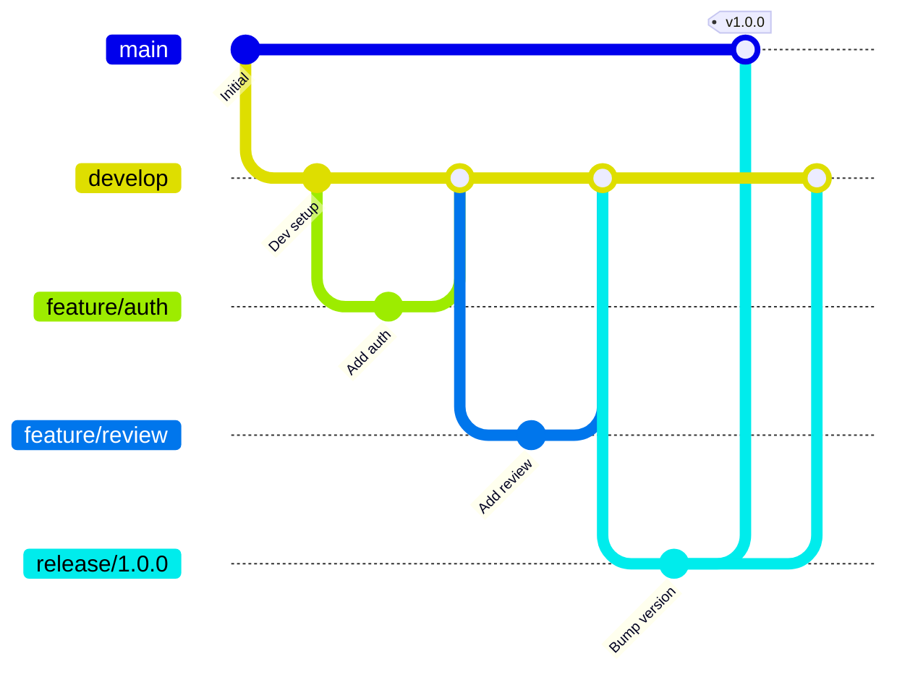
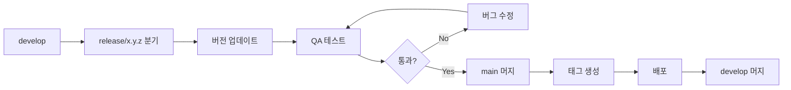

# 버전 관리 가이드

## 변경 이력

| 버전 | 날짜 | 작성자 | 변경 내용 |
|------|------|--------|----------|
| 1.0.0 | 2025-11-25 | @tech-lead | 최초 작성 |

## 관련 문서

- [CONTRIBUTING.md](./CONTRIBUTING.md) - 기여 가이드
- [docs/operations/RELEASE_MANAGEMENT.md](./docs/operations/RELEASE_MANAGEMENT.md) - 릴리스 관리

---

## 1. 시맨틱 버저닝

### 1.1 버전 형식

```
MAJOR.MINOR.PATCH[-PRERELEASE][+BUILD]

예시:
1.0.0           # 정식 릴리스
1.0.1           # 패치 릴리스
1.1.0           # 마이너 릴리스
2.0.0           # 메이저 릴리스
1.0.0-alpha.1   # 알파 릴리스
1.0.0-beta.2    # 베타 릴리스
1.0.0-rc.1      # 릴리스 후보
```

### 1.2 버전 증가 규칙

```
┌─────────────────────────────────────────────────────────────┐
│                    버전 증가 기준                            │
├─────────────────────────────────────────────────────────────┤
│  MAJOR  │  하위 호환성이 깨지는 변경                          │
│         │  - API 스펙 변경                                   │
│         │  - 데이터베이스 스키마 비호환 변경                   │
│         │  - 필수 환경 변수 변경                              │
├─────────────────────────────────────────────────────────────┤
│  MINOR  │  하위 호환되는 기능 추가                            │
│         │  - 새로운 API 엔드포인트 추가                       │
│         │  - 선택적 파라미터 추가                             │
│         │  - 새로운 기능 추가                                 │
├─────────────────────────────────────────────────────────────┤
│  PATCH  │  하위 호환되는 버그 수정                            │
│         │  - 버그 수정                                       │
│         │  - 성능 개선                                       │
│         │  - 내부 리팩토링 (API 변경 없음)                    │
└─────────────────────────────────────────────────────────────┘
```

### 1.3 예시

| 변경 내용 | 버전 변화 | 이유 |
|----------|----------|------|
| 리뷰 답변 API 응답 필드명 변경 | 1.0.0 → 2.0.0 | Breaking change |
| 인스타그램 포스팅 기능 추가 | 1.0.0 → 1.1.0 | 새 기능 추가 |
| 토큰 갱신 버그 수정 | 1.0.0 → 1.0.1 | 버그 수정 |
| 내부 로깅 개선 | 1.0.0 → 1.0.1 | 내부 변경 |

---

## 2. Git 브랜치 전략

### 2.1 브랜치 구조



### 2.2 브랜치 역할

| 브랜치 | 용도 | 생성 기준 | 머지 대상 |
|--------|------|----------|----------|
| `main` | 프로덕션 배포 | - | - |
| `develop` | 개발 통합 | main에서 분기 | main |
| `feature/*` | 기능 개발 | develop에서 분기 | develop |
| `bugfix/*` | 버그 수정 | develop에서 분기 | develop |
| `release/*` | 릴리스 준비 | develop에서 분기 | main, develop |
| `hotfix/*` | 긴급 수정 | main에서 분기 | main, develop |

### 2.3 브랜치 보호 규칙

```yaml
# main 브랜치
- 직접 push 금지
- PR을 통한 머지만 허용
- 최소 1명의 리뷰어 승인 필요
- CI 통과 필수
- 관리자도 규칙 적용

# develop 브랜치
- 직접 push 금지
- PR을 통한 머지만 허용
- CI 통과 필수
```

---

## 3. 태그 및 릴리스

### 3.1 태그 형식

```bash
# 형식
v<MAJOR>.<MINOR>.<PATCH>[-<PRERELEASE>]

# 예시
v1.0.0
v1.1.0
v2.0.0-alpha.1
v2.0.0-beta.1
v2.0.0-rc.1
```

### 3.2 태그 생성

```bash
# 태그 생성
git tag -a v1.0.0 -m "Release v1.0.0"

# 태그 푸시
git push origin v1.0.0

# 모든 태그 푸시
git push origin --tags
```

### 3.3 릴리스 프로세스



---

## 4. 변경 로그 (CHANGELOG)

### 4.1 형식

```markdown
# Changelog

All notable changes to this project will be documented in this file.

The format is based on [Keep a Changelog](https://keepachangelog.com/en/1.0.0/).

## [Unreleased]

### Added
- 새로 추가된 기능

### Changed
- 변경된 기능

### Deprecated
- 곧 제거될 기능

### Removed
- 제거된 기능

### Fixed
- 수정된 버그

### Security
- 보안 관련 수정

## [1.1.0] - 2025-12-01

### Added
- 인스타그램 포스팅 기능 추가 (#45)
- 해시태그 자동 추천 기능 (#46)

### Fixed
- 리뷰 목록 페이지네이션 버그 수정 (#42)

## [1.0.0] - 2025-11-25

### Added
- 초기 릴리스
- 구글 리뷰 자동 답변 기능
- 사용자 인증 (이메일, 구글, 카카오)
- 대시보드 기본 기능
```

### 4.2 작성 원칙

| 원칙 | 설명 |
|------|------|
| 사용자 관점 | 기술 용어보다 사용자가 이해할 수 있는 언어 사용 |
| 연결 가능성 | 관련 이슈/PR 번호 링크 |
| 일관성 | 동일한 형식 유지 |
| 최신 우선 | 최신 버전이 상단에 위치 |

---

## 5. 마이그레이션 가이드

### 5.1 Breaking Change 문서화

메이저 버전 업데이트 시 마이그레이션 가이드 필수 작성:

```markdown
# v1.x → v2.0 마이그레이션 가이드

## 개요
v2.0에서는 리뷰 API 응답 형식이 변경되었습니다.

## Breaking Changes

### 1. 리뷰 API 응답 형식 변경

**Before (v1.x):**
```json
{
  "review_id": "123",
  "review_text": "좋아요",
  "rating": 5
}
```

**After (v2.0):**
```json
{
  "id": "123",
  "content": "좋아요",
  "rating": 5,
  "metadata": {
    "source": "google",
    "createdAt": "2025-11-25T10:00:00Z"
  }
}
```

### 2. 필드명 변경 매핑

| v1.x | v2.0 | 변경 이유 |
|------|------|----------|
| `review_id` | `id` | 일관성 |
| `review_text` | `content` | 명확성 |

## 마이그레이션 단계

1. API 클라이언트 업데이트
2. 타입 정의 변경
3. 프론트엔드 컴포넌트 수정
4. 테스트 업데이트

## 지원 기간

- v1.x: 2026-05-25까지 보안 패치 지원
- v2.0: 현재 버전
```

### 5.2 Deprecation 정책

```
┌─────────────────────────────────────────────────────────────┐
│                    Deprecation 타임라인                      │
├─────────────────────────────────────────────────────────────┤
│  T+0   │  Deprecation 발표 (문서, CHANGELOG)                 │
│  T+0   │  코드에 @deprecated 표시, 경고 로그 추가             │
│  T+3M  │  리마인더 공지                                      │
│  T+6M  │  기능 제거 (다음 메이저 버전)                        │
└─────────────────────────────────────────────────────────────┘
```

---

## 6. API 버저닝

### 6.1 URL 기반 버저닝

```
https://api.salonmate.kr/v1/reviews
https://api.salonmate.kr/v2/reviews
```

### 6.2 버전 호환성 정책

| 버전 상태 | 지원 기간 | 설명 |
|----------|----------|------|
| Current | 무기한 | 현재 권장 버전 |
| Deprecated | 6개월 | 다음 메이저 버전 출시 후 |
| Sunset | - | 더 이상 지원하지 않음 |

### 6.3 버전별 응답 헤더

```http
HTTP/1.1 200 OK
X-API-Version: 2.0.0
X-API-Deprecated: false
X-API-Sunset: 2026-05-25
```

---

## 7. 의존성 관리

### 7.1 버전 고정 전략

```json
// package.json - Exact 버전 사용
{
  "dependencies": {
    "next": "14.0.4",
    "react": "18.2.0",
    "@tanstack/react-query": "5.17.0"
  }
}
```

```txt
# requirements.txt - 범위 지정
fastapi==0.109.0
sqlalchemy>=2.0.0,<3.0.0
pydantic>=2.0.0,<3.0.0
```

### 7.2 의존성 업데이트 정책

| 종류 | 주기 | 담당 |
|------|------|------|
| 보안 패치 | 즉시 | @security-team |
| 패치 버전 | 주간 | Dependabot |
| 마이너 버전 | 월간 | @tech-lead |
| 메이저 버전 | 분기별 검토 | @core-team |

### 7.3 Dependabot 설정

```yaml
# .github/dependabot.yml
version: 2
updates:
  - package-ecosystem: "npm"
    directory: "/src/frontend"
    schedule:
      interval: "weekly"
    open-pull-requests-limit: 5
    labels:
      - "dependencies"
      - "frontend"

  - package-ecosystem: "pip"
    directory: "/src/backend"
    schedule:
      interval: "weekly"
    open-pull-requests-limit: 5
    labels:
      - "dependencies"
      - "backend"
```

---

## 8. 환경별 버전 관리

### 8.1 환경 구성

| 환경 | 브랜치 | 버전 | 용도 |
|------|--------|------|------|
| Development | develop | latest | 개발자 테스트 |
| Staging | release/* | RC | QA 테스트 |
| Production | main | stable | 실서비스 |

### 8.2 Feature Flag

기능 플래그를 통한 점진적 롤아웃:

```typescript
// 기능 플래그 예시
const features = {
  'instagram-posting': {
    enabled: process.env.NODE_ENV === 'production'
      ? ['beta-users']
      : true,
    rolloutPercentage: 10,
  },
  'new-dashboard': {
    enabled: false,
    releaseDate: '2025-12-01',
  },
};
```

---

## 9. 롤백 절차

### 9.1 빠른 롤백

```bash
# 프로덕션 롤백 (Vercel)
vercel rollback

# 컨테이너 롤백 (Kubernetes)
kubectl rollout undo deployment/salonmate-api

# Git 태그 기반 롤백
git checkout v1.0.0
```

### 9.2 롤백 체크리스트

- [ ] 롤백 대상 버전 확인
- [ ] 데이터베이스 호환성 확인
- [ ] 롤백 실행
- [ ] 헬스체크 확인
- [ ] 사용자 영향 모니터링
- [ ] 팀 공지
- [ ] 포스트모템 작성

---

## 10. 버전 관리 도구

### 10.1 자동 버전 업데이트

```json
// package.json scripts
{
  "scripts": {
    "version:patch": "npm version patch",
    "version:minor": "npm version minor",
    "version:major": "npm version major",
    "release": "standard-version"
  }
}
```

### 10.2 Conventional Commits 도구

```bash
# commitizen 설치
npm install -g commitizen

# 커밋 시
git cz
```

### 10.3 릴리스 자동화

```yaml
# .github/workflows/release.yml
name: Release

on:
  push:
    tags:
      - 'v*'

jobs:
  release:
    runs-on: ubuntu-latest
    steps:
      - uses: actions/checkout@v4
      - name: Create Release
        uses: softprops/action-gh-release@v1
        with:
          generate_release_notes: true
```

---

*일관된 버전 관리는 안정적인 서비스 운영의 기반입니다.*
