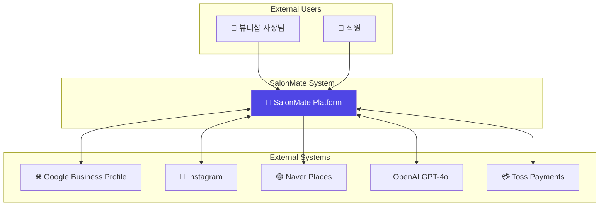
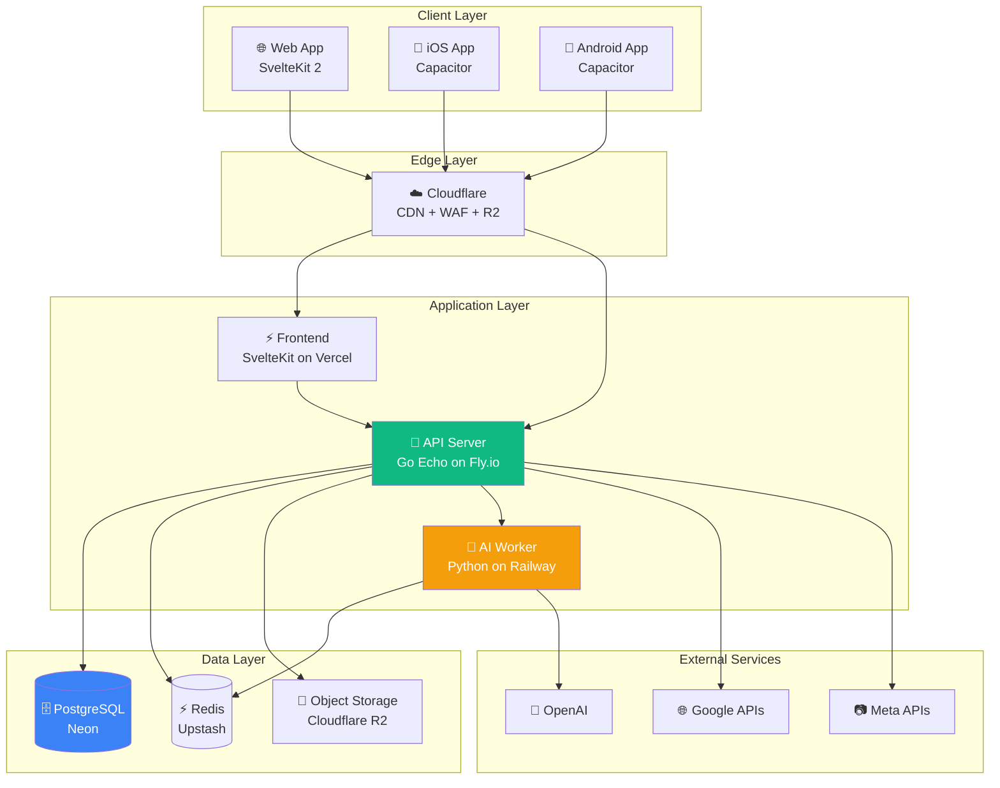
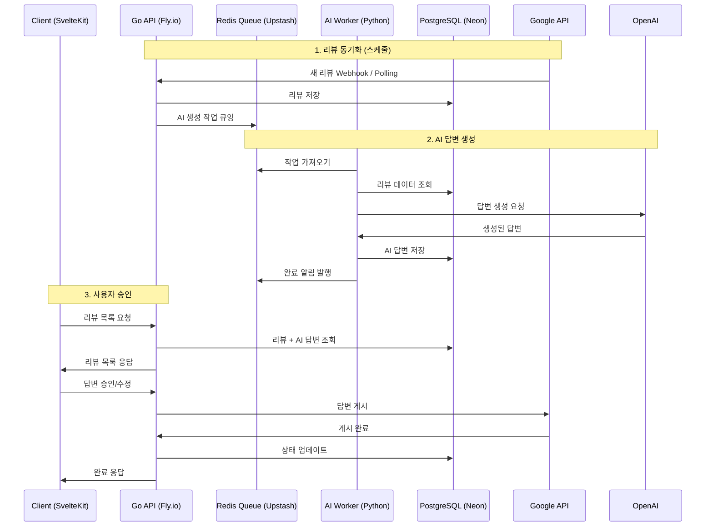
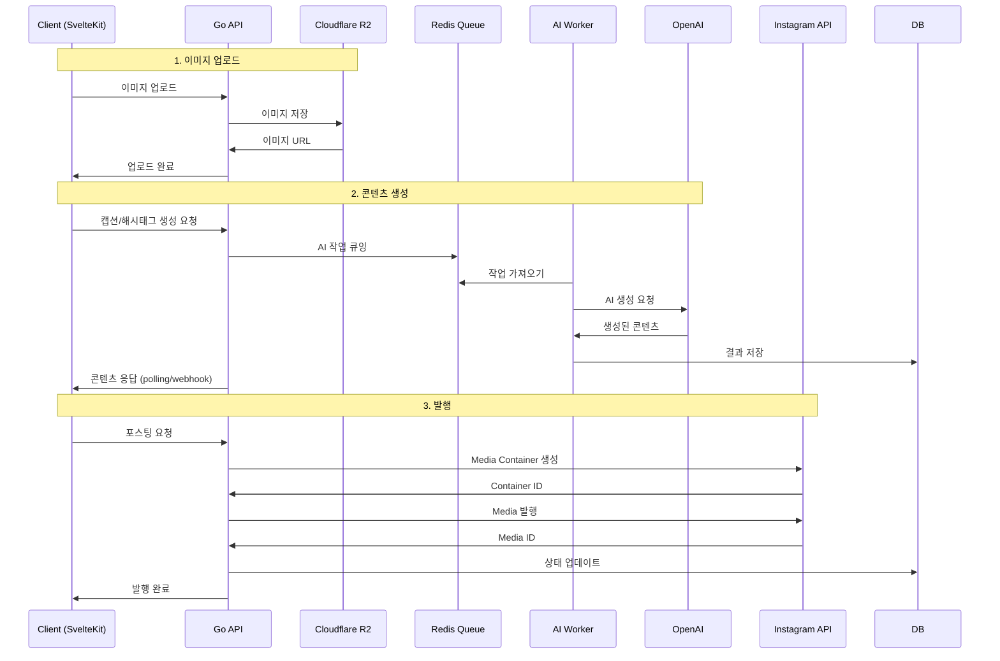
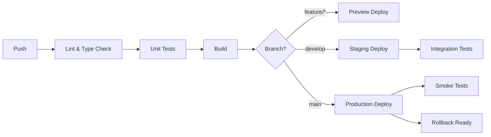

# 시스템 아키텍처

## 변경 이력

| 버전 | 날짜 | 작성자 | 변경 내용 |
|------|------|--------|----------|
| 2.0.0 | 2025-11-25 | @tech-lead | SvelteKit + Go + Python Worker 스택으로 변경 |
| 1.0.0 | 2025-11-25 | @tech-lead | 최초 작성 |

## 관련 문서

- [CONTEXT.md](../../CONTEXT.md) - 프로젝트 컨텍스트
- [PRD.md](./PRD.md) - 제품 요구사항
- [API_SPEC.md](./API_SPEC.md) - API 명세
- [DATA_MODEL.md](./DATA_MODEL.md) - 데이터 모델
- [TECH_STACK_ALTERNATIVES.md](./TECH_STACK_ALTERNATIVES.md) - 기술 스택 비교 분석

---

## 1. 아키텍처 개요

### 1.1 시스템 컨텍스트 (C4 Level 1)



### 1.2 컨테이너 다이어그램 (C4 Level 2)



---

## 2. 기술 스택 상세

### 2.1 Frontend (SvelteKit)

```yaml
Framework:
  name: SvelteKit 2.0
  features:
    - SSR (Server-Side Rendering)
    - SSG (Static Site Generation)
    - Form Actions
    - Load Functions
    - Streaming

Language:
  name: TypeScript 5.x
  config:
    strict: true
    noImplicitAny: true

UI Library:
  name: Svelte 5
  features:
    - Runes ($state, $derived, $effect)
    - Fine-grained Reactivity
    - Built-in Transitions

Styling:
  framework: Tailwind CSS 3.4
  components: Skeleton UI
  features:
    - Dark Mode
    - Design Tokens
    - Responsive

Mobile:
  name: Capacitor
  platforms: [iOS, Android]
  plugins:
    - Camera
    - Push Notifications
    - Share
    - Haptics
```

### 2.2 Backend API (Go)

```yaml
Language:
  name: Go 1.22+
  features:
    - Generics
    - Structured Logging (slog)
    - Enhanced HTTP Routing

Framework:
  name: Echo v4
  features:
    - High Performance (~100k req/s)
    - Middleware Support
    - WebSocket Support
    - Request Binding & Validation

Database:
  query_builder: sqlc
  features:
    - Compile-time SQL Verification
    - Type-safe Go Code Generation
    - PostgreSQL Native Types

Migration:
  tool: golang-migrate
  features:
    - Version Control
    - Up/Down Migrations
    - CLI & Library

Task Queue:
  name: Asynq
  broker: Redis (Upstash)
  features:
    - Reliable Task Processing
    - Scheduled Tasks
    - Retry with Backoff
    - Web UI Dashboard

Authentication:
  jwt: golang-jwt/jwt/v5
  oauth:
    - Google OAuth 2.0
    - Kakao OAuth 2.0
```

### 2.3 AI Worker (Python)

```yaml
Language:
  name: Python 3.12
  type_checking: mypy (strict)

LLM Framework:
  name: LangChain
  version: 0.2+
  features:
    - Prompt Templates
    - Output Parsers
    - Chain Composition
    - Memory Management

Orchestration:
  name: LangGraph
  features:
    - State Machines
    - Conditional Routing
    - Human-in-the-loop

Primary LLM:
  provider: OpenAI
  model: gpt-4o
  use_cases:
    - Review Response Generation
    - Caption Generation
    - Hashtag Recommendation

Fallback LLM:
  models:
    - gpt-4o-mini (cost optimization)
    - claude-3-haiku (diversity)

Embedding:
  provider: OpenAI
  model: text-embedding-3-small
  use_cases:
    - Similar Review Detection
    - Content Categorization

Communication:
  primary: Redis Queue (Asynq compatible)
  alternative: gRPC (for low-latency)
```

### 2.4 Infrastructure

```yaml
Database:
  provider: Neon
  engine: PostgreSQL 16
  features:
    - Serverless Auto-scaling
    - Database Branching
    - Connection Pooling (pgbouncer)
    - Point-in-time Recovery

Cache & Queue:
  provider: Upstash
  engine: Redis
  use_cases:
    - Session Storage
    - Rate Limiting
    - Task Queue (Asynq)
    - Response Caching

Storage:
  provider: Cloudflare R2
  features:
    - S3-compatible API
    - Zero Egress Fees
    - Global Distribution
    - Image Optimization (via Workers)

Hosting:
  frontend:
    provider: Vercel
    features:
      - Edge Functions
      - Preview Deployments
      - Analytics

  backend:
    provider: Fly.io
    features:
      - Global Edge Deployment
      - Auto-scaling
      - Private Networking
      - Persistent Volumes

  ai_worker:
    provider: Railway
    features:
      - Easy Python Deployment
      - Auto-scaling
      - Cron Jobs

CDN & Security:
  provider: Cloudflare
  features:
    - DDoS Protection
    - WAF Rules
    - Bot Management
    - Edge Caching

Monitoring:
  error_tracking: Sentry
  metrics: Grafana Cloud (Free tier)
  logs: Grafana Loki
```

---

## 3. 컴포넌트 아키텍처

### 3.1 Go Backend 레이어 구조

```
┌─────────────────────────────────────────────────────────────────┐
│                        Handler Layer                             │
│  ┌─────────────┐ ┌─────────────┐ ┌─────────────┐                │
│  │   Handlers  │ │    DTOs     │ │ Middleware  │                │
│  │ (HTTP)      │ │ (Request/   │ │ (Auth, Log, │                │
│  │             │ │  Response)  │ │  RateLimit) │                │
│  └─────────────┘ └─────────────┘ └─────────────┘                │
├─────────────────────────────────────────────────────────────────┤
│                        Service Layer                             │
│  ┌─────────────┐ ┌─────────────┐ ┌─────────────┐                │
│  │  Services   │ │   Domain    │ │    Ports    │                │
│  │ (Biz Logic) │ │   Models    │ │ (Interfaces)│                │
│  └─────────────┘ └─────────────┘ └─────────────┘                │
├─────────────────────────────────────────────────────────────────┤
│                      Repository Layer                            │
│  ┌─────────────┐ ┌─────────────┐ ┌─────────────┐                │
│  │    sqlc     │ │  External   │ │   Cache     │                │
│  │  Queries    │ │   Clients   │ │  Adapters   │                │
│  └─────────────┘ └─────────────┘ └─────────────┘                │
└─────────────────────────────────────────────────────────────────┘
```

### 3.2 디렉토리 구조

```
salon-mate/
├── frontend/                    # SvelteKit 프론트엔드
│   ├── src/
│   │   ├── routes/              # 라우트 (페이지)
│   │   │   ├── (auth)/          # 인증 그룹
│   │   │   │   ├── login/
│   │   │   │   └── signup/
│   │   │   ├── (app)/           # 앱 그룹 (인증 필요)
│   │   │   │   ├── dashboard/
│   │   │   │   ├── reviews/
│   │   │   │   ├── instagram/
│   │   │   │   └── settings/
│   │   │   ├── +layout.svelte
│   │   │   └── +page.svelte     # 랜딩
│   │   ├── lib/
│   │   │   ├── components/      # 재사용 컴포넌트
│   │   │   │   ├── ui/          # 기본 UI (Skeleton)
│   │   │   │   └── features/    # 기능별 컴포넌트
│   │   │   ├── stores/          # Svelte Stores
│   │   │   ├── api/             # API 클라이언트
│   │   │   └── utils/           # 유틸리티
│   │   └── app.html
│   ├── static/                  # 정적 파일
│   ├── svelte.config.js
│   ├── tailwind.config.js
│   └── package.json
│
├── backend/                     # Go API 서버
│   ├── cmd/
│   │   ├── api/                 # API 서버 진입점
│   │   │   └── main.go
│   │   └── worker/              # Asynq Worker 진입점
│   │       └── main.go
│   ├── internal/
│   │   ├── config/              # 설정
│   │   │   └── config.go
│   │   ├── handler/             # HTTP 핸들러
│   │   │   ├── auth.go
│   │   │   ├── review.go
│   │   │   ├── instagram.go
│   │   │   └── health.go
│   │   ├── middleware/          # 미들웨어
│   │   │   ├── auth.go
│   │   │   ├── logger.go
│   │   │   └── ratelimit.go
│   │   ├── service/             # 비즈니스 로직
│   │   │   ├── auth_service.go
│   │   │   ├── review_service.go
│   │   │   └── instagram_service.go
│   │   ├── repository/          # 데이터 접근
│   │   │   └── queries/         # sqlc 쿼리
│   │   ├── domain/              # 도메인 모델
│   │   │   ├── user.go
│   │   │   ├── review.go
│   │   │   └── post.go
│   │   ├── client/              # 외부 API 클라이언트
│   │   │   ├── google.go
│   │   │   ├── instagram.go
│   │   │   └── openai.go
│   │   └── task/                # Asynq 태스크
│   │       ├── review_task.go
│   │       └── sync_task.go
│   ├── db/
│   │   ├── migrations/          # SQL 마이그레이션
│   │   ├── queries/             # sqlc SQL 파일
│   │   └── sqlc.yaml
│   ├── go.mod
│   └── go.sum
│
├── ai-worker/                   # Python AI Worker
│   ├── src/
│   │   ├── main.py              # 진입점
│   │   ├── config.py            # 설정
│   │   ├── tasks/               # 태스크 핸들러
│   │   │   ├── review_response.py
│   │   │   ├── caption_generation.py
│   │   │   └── hashtag_recommendation.py
│   │   ├── chains/              # LangChain 체인
│   │   │   ├── review_chain.py
│   │   │   └── content_chain.py
│   │   ├── prompts/             # 프롬프트 템플릿
│   │   │   ├── review_prompts.py
│   │   │   └── content_prompts.py
│   │   └── utils/
│   │       └── redis_client.py
│   ├── tests/
│   ├── pyproject.toml
│   └── requirements.txt
│
├── infra/                       # 인프라 설정
│   ├── docker/
│   │   ├── Dockerfile.api
│   │   ├── Dockerfile.worker
│   │   └── Dockerfile.frontend
│   ├── docker-compose.yml
│   └── fly.toml                 # Fly.io 설정
│
├── docs/                        # 문서
│   └── specs/
│
└── scripts/                     # 스크립트
    ├── setup.sh
    └── migrate.sh
```

---

## 4. 데이터 흐름

### 4.1 리뷰 답변 생성 플로우



### 4.2 인스타 포스팅 플로우



---

## 5. API 설계

### 5.1 API 버저닝

```
https://api.salonmate.kr/v1/...
```

### 5.2 인증 흐름

```mermaid
sequenceDiagram
    participant C as Client
    participant API as Go API
    participant DB as Database
    participant R as Redis

    C->>API: POST /v1/auth/login
    API->>DB: 사용자 확인
    DB->>API: 사용자 정보
    API->>API: JWT 생성 (Access + Refresh)
    API->>R: Refresh Token 저장
    API->>C: { accessToken, refreshToken }

    Note over C,API: 이후 요청
    C->>API: GET /v1/reviews<br/>Authorization: Bearer {accessToken}
    API->>API: JWT 검증
    API->>DB: 데이터 조회
    API->>C: 응답

    Note over C,R: 토큰 갱신
    C->>API: POST /v1/auth/refresh<br/>{ refreshToken }
    API->>R: Refresh Token 검증
    R->>API: Valid
    API->>API: 새 Access Token 생성
    API->>C: { accessToken (new) }
```



### 5.3 에러 응답 형식

```json
{
  "error": {
    "code": "REVIEW_NOT_FOUND",
    "message": "요청한 리뷰를 찾을 수 없습니다.",
    "details": {
      "reviewId": "rv_123456"
    },
    "timestamp": "2025-11-25T10:30:00Z",
    "requestId": "req_abc123"
  }
}
```

---

## 6. 보안 아키텍처

### 6.1 인증/인가

```
┌─────────────────────────────────────────────────────────────────┐
│                        인증 흐름                                 │
├─────────────────────────────────────────────────────────────────┤
│                                                                 │
│   [Client]                                                      │
│       │                                                         │
│       ▼                                                         │
│   ┌─────────────────┐    ┌─────────────────┐                   │
│   │ Email/Password  │ OR │  OAuth 2.0      │                   │
│   │ Login           │    │  (Google/Kakao) │                   │
│   └────────┬────────┘    └────────┬────────┘                   │
│            │                      │                             │
│            └──────────┬───────────┘                             │
│                       ▼                                         │
│               ┌───────────────┐                                 │
│               │ JWT 발급      │                                 │
│               │ - Access (15m)│                                 │
│               │ - Refresh (7d)│                                 │
│               └───────────────┘                                 │
│                       │                                         │
│                       ▼                                         │
│               ┌───────────────┐                                 │
│               │ API 요청 인증  │                                │
│               │ Bearer Token  │                                 │
│               └───────────────┘                                 │
│                                                                 │
└─────────────────────────────────────────────────────────────────┘
```

### 6.2 데이터 보안

| 항목 | 방법 |
|------|------|
| 전송 암호화 | TLS 1.3 (Cloudflare) |
| 저장 암호화 | AES-256 (Neon 제공) |
| 비밀번호 | bcrypt (cost=12) / Argon2id |
| API 키 | 환경 변수, Fly.io Secrets |
| 세션 | Redis, HTTPOnly Cookie |

### 6.3 API 보안

```go
// Rate Limiting 설정 (Go Echo)
rateLimits := map[string]string{
    "default":       "100/minute",
    "auth":          "10/minute",
    "ai_generation": "20/minute",
}

// CORS 설정
corsOrigins := []string{
    "https://app.salonmate.kr",
    "https://www.salonmate.kr",
    "capacitor://localhost",  // 모바일 앱
}
```

---

## 7. 확장성 설계

### 7.1 수평 확장

```mermaid
graph TB
    subgraph Edge
        CF[Cloudflare]
    end

    subgraph API Instances (Fly.io)
        API1[Go API 1<br/>Seoul]
        API2[Go API 2<br/>Tokyo]
        API3[Go API N<br/>Auto-scale]
    end

    subgraph AI Workers (Railway)
        W1[Python Worker 1]
        W2[Python Worker N]
    end

    subgraph Shared Resources
        DB[(Neon PostgreSQL)]
        REDIS[(Upstash Redis<br/>Global)]
    end

    CF --> API1
    CF --> API2
    CF --> API3

    API1 --> DB
    API2 --> DB
    API3 --> DB

    API1 --> REDIS
    API2 --> REDIS
    API3 --> REDIS

    W1 --> REDIS
    W2 --> REDIS

    W1 --> DB
    W2 --> DB
```

### 7.2 캐싱 전략

| 데이터 | TTL | 캐시 위치 |
|--------|-----|----------|
| 사용자 세션 | 15분 | Redis |
| 리뷰 목록 | 5분 | Redis + Edge |
| AI 응답 (동일 리뷰) | 24시간 | Redis |
| 정적 자산 | 7일 | Cloudflare CDN |
| API 응답 | 1분 | Edge (stale-while-revalidate) |

### 7.3 데이터베이스 최적화

```sql
-- 주요 인덱스
CREATE INDEX idx_reviews_shop_created ON reviews(shop_id, created_at DESC);
CREATE INDEX idx_reviews_status ON reviews(status) WHERE status = 'pending';
CREATE INDEX idx_posts_shop_scheduled ON posts(shop_id, scheduled_at);

-- Connection Pooling (Neon pgbouncer)
-- 기본 제공, 설정 불필요

-- Read Replicas (필요시)
-- Neon branching으로 읽기 전용 복제본 생성 가능
```

---

## 8. 모니터링 및 관찰성

### 8.1 메트릭

```yaml
Application Metrics:
  - request_count (by endpoint, status)
  - request_latency_p99
  - error_rate
  - active_users

Business Metrics:
  - reviews_processed
  - ai_generations
  - posts_published
  - subscription_events

Infrastructure Metrics:
  - cpu_usage
  - memory_usage
  - db_connections
  - cache_hit_rate
  - queue_depth
```

### 8.2 로깅 (Go slog)

```go
// 구조화된 로그 형식
slog.Info("Review AI response generated",
    "service", "ai-worker",
    "trace_id", traceID,
    "user_id", userID,
    "review_id", reviewID,
    "duration_ms", duration.Milliseconds(),
)
```

```json
{
    "time": "2025-11-25T10:30:00.000Z",
    "level": "INFO",
    "msg": "Review AI response generated",
    "service": "ai-worker",
    "trace_id": "abc123",
    "user_id": "user_123",
    "review_id": "rv_456",
    "duration_ms": 2500
}
```

### 8.3 알림

| 조건 | 심각도 | 알림 채널 |
|------|--------|----------|
| 에러율 > 1% | Warning | Slack |
| 에러율 > 5% | Critical | Slack + PagerDuty |
| API 응답 > 500ms (p95) | Warning | Slack |
| DB 연결 풀 > 80% | Warning | Slack |
| Worker 큐 백로그 > 1000 | Critical | Slack + PagerDuty |

---

## 9. 배포 아키텍처

### 9.1 환경

```
┌─────────────────────────────────────────────────────────────────┐
│  Development        Staging           Production               │
├─────────────────────────────────────────────────────────────────┤
│  ┌──────────┐      ┌──────────┐      ┌──────────┐              │
│  │ Vercel   │      │ Vercel   │      │ Vercel   │              │
│  │ Preview  │      │ Preview  │      │ Production│             │
│  └──────────┘      └──────────┘      └──────────┘              │
│       │                 │                 │                     │
│  ┌──────────┐      ┌──────────┐      ┌──────────┐              │
│  │ Fly.io   │      │ Fly.io   │      │ Fly.io   │              │
│  │ Dev      │      │ Staging  │      │ Production│             │
│  └──────────┘      └──────────┘      └──────────┘              │
│       │                 │                 │                     │
│  ┌──────────┐      ┌──────────┐      ┌──────────┐              │
│  │ Neon     │      │ Neon     │      │ Neon     │              │
│  │ Branch   │      │ Branch   │      │ Main     │              │
│  └──────────┘      └──────────┘      └──────────┘              │
└─────────────────────────────────────────────────────────────────┘
```

### 9.2 CI/CD 파이프라인



### 9.3 배포 명령어

```bash
# Frontend (Vercel) - 자동 배포
git push origin main

# Backend (Fly.io)
fly deploy --config fly.toml

# AI Worker (Railway) - 자동 배포
git push origin main

# Database Migration
fly ssh console -C "migrate -database $DATABASE_URL -path db/migrations up"
```

---

## 10. 성능 벤치마크 (예상)

### 10.1 응답 시간 목표

| 엔드포인트 | 목표 (p95) | 설명 |
|-----------|-----------|------|
| GET /reviews | < 100ms | 리스트 조회 |
| POST /reviews/:id/response | < 200ms | 답변 저장 |
| AI 답변 생성 | < 5s | 비동기 처리 |
| 이미지 업로드 | < 2s | R2 직접 업로드 |

### 10.2 처리량 목표

| 지표 | 목표 |
|------|------|
| API 동시 요청 | 1,000+ |
| 초당 요청 (RPS) | 10,000+ |
| AI 작업 처리 | 100/분 |

---

## 11. ADR (Architecture Decision Records)

주요 아키텍처 결정 사항은 [ADRs 디렉토리](./ADRs/)에서 관리합니다.

| ADR | 제목 | 상태 |
|-----|------|------|
| ADR-0001 | SvelteKit + Go + Python 스택 선정 | Accepted |
| ADR-0002 | Neon PostgreSQL 선정 | Accepted |
| ADR-0003 | Fly.io 글로벌 배포 | Accepted |
| ADR-0004 | AI Worker 분리 아키텍처 | Accepted |

---

*이 문서는 시스템 변경에 따라 지속적으로 업데이트됩니다.*
