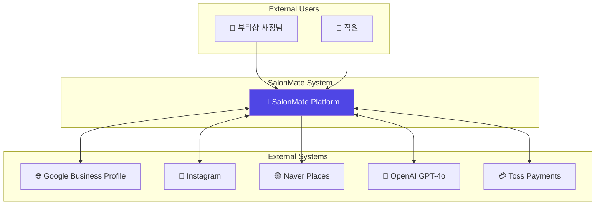
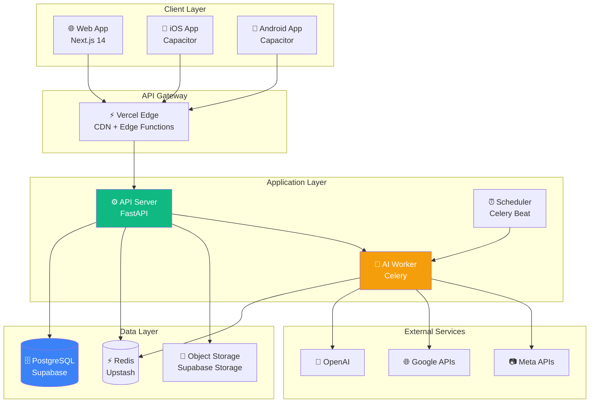
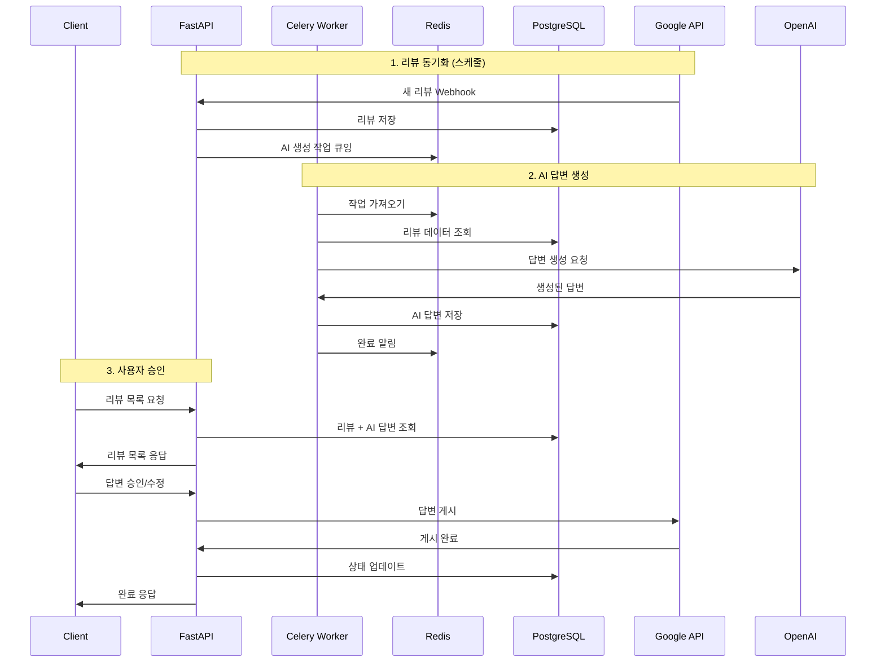
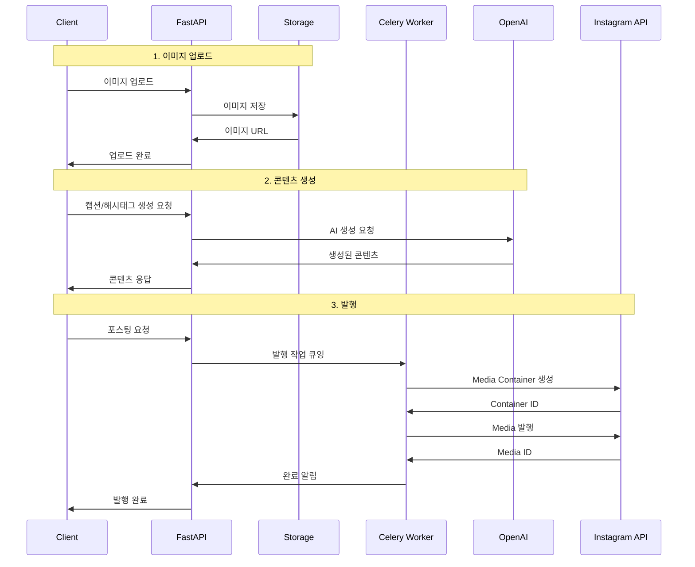
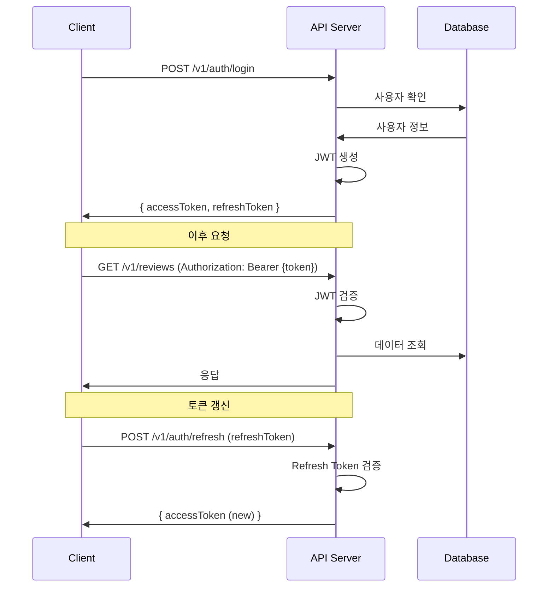
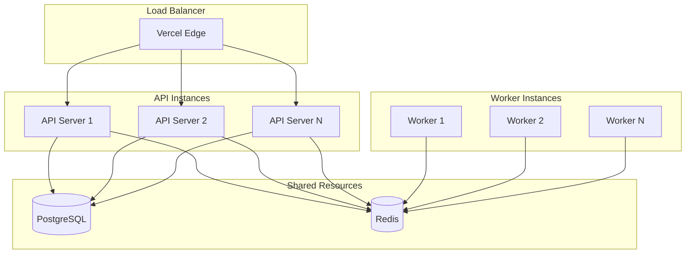
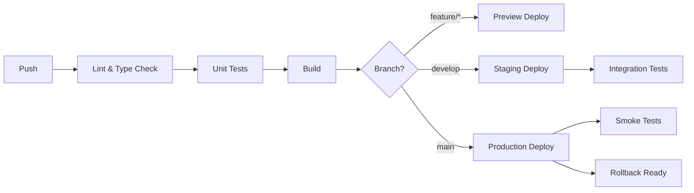

# 시스템 아키텍처

## 변경 이력

| 버전 | 날짜 | 작성자 | 변경 내용 |
|------|------|--------|----------|
| 1.0.0 | 2025-11-25 | @tech-lead | 최초 작성 |

## 관련 문서

- [CONTEXT.md](../../CONTEXT.md) - 프로젝트 컨텍스트
- [PRD.md](./PRD.md) - 제품 요구사항
- [API_SPEC.md](./API_SPEC.md) - API 명세
- [DATA_MODEL.md](./DATA_MODEL.md) - 데이터 모델

---

## 1. 아키텍처 개요

### 1.1 시스템 컨텍스트 (C4 Level 1)



### 1.2 컨테이너 다이어그램 (C4 Level 2)



---

## 2. 기술 스택 상세

### 2.1 Frontend

```yaml
Framework:
  name: Next.js 14
  features:
    - App Router (Server Components)
    - Server Actions
    - ISR (Incremental Static Regeneration)
    - Edge Runtime

Language:
  name: TypeScript 5.x
  config:
    strict: true
    noImplicitAny: true

UI Library:
  name: shadcn/ui
  base: Radix UI
  styling: Tailwind CSS

State Management:
  client: Zustand
  server: TanStack Query v5

Mobile:
  name: Capacitor
  platforms: [iOS, Android]
  plugins:
    - Camera
    - Push Notifications
    - Share
```

### 2.2 Backend

```yaml
Framework:
  name: FastAPI
  version: "0.109+"
  features:
    - Async/Await
    - Automatic OpenAPI docs
    - Dependency Injection
    - Background Tasks

Language:
  name: Python 3.12
  type_checking: mypy

ORM:
  name: SQLAlchemy 2.0
  features:
    - Async support
    - Type annotations
  migrations: Alembic

Validation:
  name: Pydantic v2
  features:
    - Data validation
    - Settings management
    - JSON Schema generation

Task Queue:
  name: Celery
  broker: Redis
  result_backend: Redis
  scheduler: Celery Beat
```

### 2.3 AI / Worker

```yaml
Primary LLM:
  provider: OpenAI
  model: gpt-4o
  use_cases:
    - Review response generation
    - Caption generation
    - Hashtag recommendation

Fallback LLM:
  provider: OpenAI
  model: gpt-4o-mini
  use_cases:
    - High volume requests
    - Cost optimization

Embedding:
  provider: OpenAI
  model: text-embedding-3-small
  use_cases:
    - Similar review detection
    - Content categorization

Framework:
  name: LangChain
  features:
    - Prompt templates
    - Output parsers
    - Chain composition
```

### 2.4 Infrastructure

```yaml
Database:
  provider: Supabase
  engine: PostgreSQL 15
  features:
    - Row Level Security
    - Realtime subscriptions
    - Full-text search

Cache:
  provider: Upstash
  engine: Redis
  use_cases:
    - Session storage
    - Rate limiting
    - Task queue
    - Response caching

Storage:
  provider: Supabase Storage
  features:
    - Image optimization
    - CDN distribution
    - Access policies

Hosting:
  frontend: Vercel
  backend: Railway
  features:
    - Auto-scaling
    - Preview deployments
    - Edge functions

Monitoring:
  error_tracking: Sentry
  apm: Datadog
  logs: Datadog Logs
```

---

## 3. 컴포넌트 아키텍처

### 3.1 Backend 레이어 구조

```
┌─────────────────────────────────────────────────────────────────┐
│                        Presentation Layer                        │
│  ┌─────────────┐ ┌─────────────┐ ┌─────────────┐                │
│  │   Routers   │ │   Schemas   │ │   Deps      │                │
│  │  (Endpoints)│ │  (Pydantic) │ │(Dependencies)│               │
│  └─────────────┘ └─────────────┘ └─────────────┘                │
├─────────────────────────────────────────────────────────────────┤
│                        Application Layer                         │
│  ┌─────────────┐ ┌─────────────┐ ┌─────────────┐                │
│  │  Services   │ │   UseCases  │ │    DTOs     │                │
│  │(Biz Logic)  │ │ (Workflows) │ │(Data Trans) │                │
│  └─────────────┘ └─────────────┘ └─────────────┘                │
├─────────────────────────────────────────────────────────────────┤
│                         Domain Layer                             │
│  ┌─────────────┐ ┌─────────────┐ ┌─────────────┐                │
│  │   Entities  │ │   Value     │ │  Domain     │                │
│  │             │ │   Objects   │ │  Events     │                │
│  └─────────────┘ └─────────────┘ └─────────────┘                │
├─────────────────────────────────────────────────────────────────┤
│                      Infrastructure Layer                        │
│  ┌─────────────┐ ┌─────────────┐ ┌─────────────┐                │
│  │Repositories │ │  External   │ │   Cache     │                │
│  │   (DB)      │ │   APIs      │ │  Adapters   │                │
│  └─────────────┘ └─────────────┘ └─────────────┘                │
└─────────────────────────────────────────────────────────────────┘
```

### 3.2 디렉토리 구조

```
src/backend/
├── main.py                 # FastAPI 앱 진입점
├── config/                 # 설정
│   ├── settings.py         # 환경 변수, 설정
│   └── database.py         # DB 연결 설정
│
├── api/                    # Presentation Layer
│   ├── v1/
│   │   ├── __init__.py
│   │   ├── auth.py         # 인증 엔드포인트
│   │   ├── reviews.py      # 리뷰 엔드포인트
│   │   ├── instagram.py    # 인스타그램 엔드포인트
│   │   └── users.py        # 사용자 엔드포인트
│   ├── deps.py             # 의존성 (인증, DB 세션)
│   └── errors.py           # 에러 핸들러
│
├── services/               # Application Layer
│   ├── auth_service.py     # 인증 서비스
│   ├── review_service.py   # 리뷰 서비스
│   ├── ai_service.py       # AI 생성 서비스
│   └── instagram_service.py# 인스타 서비스
│
├── domain/                 # Domain Layer
│   ├── entities/           # 도메인 엔티티
│   │   ├── user.py
│   │   ├── review.py
│   │   └── post.py
│   ├── value_objects/      # 값 객체
│   └── events/             # 도메인 이벤트
│
├── infrastructure/         # Infrastructure Layer
│   ├── repositories/       # 저장소 구현
│   │   ├── user_repo.py
│   │   └── review_repo.py
│   ├── external/           # 외부 API 클라이언트
│   │   ├── google_client.py
│   │   ├── instagram_client.py
│   │   └── openai_client.py
│   └── cache/              # 캐시 어댑터
│       └── redis_cache.py
│
├── schemas/                # Pydantic 스키마
│   ├── auth.py
│   ├── review.py
│   └── instagram.py
│
├── models/                 # SQLAlchemy 모델
│   ├── base.py
│   ├── user.py
│   ├── review.py
│   └── post.py
│
└── worker/                 # Celery 작업
    ├── celery_app.py
    ├── tasks/
    │   ├── review_tasks.py
    │   ├── ai_tasks.py
    │   └── sync_tasks.py
    └── schedules.py
```

### 3.3 Frontend 컴포넌트 구조

```
src/frontend/
├── app/                    # Next.js App Router
│   ├── (auth)/             # 인증 관련 라우트 그룹
│   │   ├── login/
│   │   ├── signup/
│   │   └── layout.tsx
│   ├── (dashboard)/        # 대시보드 라우트 그룹
│   │   ├── page.tsx        # 메인 대시보드
│   │   ├── reviews/        # 리뷰 관리
│   │   ├── instagram/      # 인스타 관리
│   │   ├── settings/       # 설정
│   │   └── layout.tsx
│   ├── api/                # API Routes (BFF)
│   ├── layout.tsx          # 루트 레이아웃
│   └── page.tsx            # 랜딩 페이지
│
├── components/             # UI 컴포넌트
│   ├── ui/                 # shadcn/ui 기본 컴포넌트
│   │   ├── button.tsx
│   │   ├── card.tsx
│   │   └── ...
│   ├── features/           # 기능별 컴포넌트
│   │   ├── reviews/
│   │   │   ├── ReviewCard.tsx
│   │   │   ├── ReviewList.tsx
│   │   │   └── AIResponseEditor.tsx
│   │   ├── instagram/
│   │   │   ├── PostCreator.tsx
│   │   │   ├── CaptionEditor.tsx
│   │   │   └── HashtagPicker.tsx
│   │   └── dashboard/
│   │       ├── StatsCard.tsx
│   │       └── RecentActivity.tsx
│   └── layout/             # 레이아웃 컴포넌트
│       ├── Header.tsx
│       ├── Sidebar.tsx
│       └── Footer.tsx
│
├── hooks/                  # 커스텀 훅
│   ├── useAuth.ts
│   ├── useReviews.ts
│   └── useInstagram.ts
│
├── lib/                    # 유틸리티
│   ├── api.ts              # API 클라이언트
│   ├── auth.ts             # 인증 유틸
│   └── utils.ts            # 공통 유틸
│
├── stores/                 # Zustand 스토어
│   ├── authStore.ts
│   └── uiStore.ts
│
└── types/                  # TypeScript 타입
    ├── api.ts
    ├── review.ts
    └── instagram.ts
```

---

## 4. 데이터 흐름

### 4.1 리뷰 답변 생성 플로우



### 4.2 인스타 포스팅 플로우



---

## 5. API 설계

### 5.1 API 버저닝

```
https://api.salonmate.kr/v1/...
```

### 5.2 인증 흐름



### 5.3 에러 응답 형식

```json
{
  "error": {
    "code": "REVIEW_NOT_FOUND",
    "message": "요청한 리뷰를 찾을 수 없습니다.",
    "details": {
      "reviewId": "rv_123456"
    },
    "timestamp": "2025-11-25T10:30:00Z",
    "requestId": "req_abc123"
  }
}
```

---

## 6. 보안 아키텍처

### 6.1 인증/인가

```
┌─────────────────────────────────────────────────────────────────┐
│                        인증 흐름                                 │
├─────────────────────────────────────────────────────────────────┤
│                                                                 │
│   [Client]                                                      │
│       │                                                         │
│       ▼                                                         │
│   ┌─────────────────┐    ┌─────────────────┐                   │
│   │ Email/Password  │ OR │  OAuth 2.0      │                   │
│   │ Login           │    │  (Google/Kakao) │                   │
│   └────────┬────────┘    └────────┬────────┘                   │
│            │                      │                             │
│            └──────────┬───────────┘                             │
│                       ▼                                         │
│               ┌───────────────┐                                 │
│               │ JWT 발급      │                                 │
│               │ - Access (30m)│                                 │
│               │ - Refresh (7d)│                                 │
│               └───────────────┘                                 │
│                       │                                         │
│                       ▼                                         │
│               ┌───────────────┐                                 │
│               │ API 요청 인증  │                                │
│               │ Bearer Token  │                                 │
│               └───────────────┘                                 │
│                                                                 │
└─────────────────────────────────────────────────────────────────┘
```

### 6.2 데이터 보안

| 항목 | 방법 |
|------|------|
| 전송 암호화 | TLS 1.3 |
| 저장 암호화 | AES-256 (Supabase 제공) |
| 비밀번호 | bcrypt (cost=12) |
| API 키 | 환경 변수, Vault |
| 세션 | Redis, HTTPOnly Cookie |

### 6.3 API 보안

```python
# Rate Limiting 설정
rate_limits = {
    "default": "100/minute",
    "auth": "10/minute",
    "ai_generation": "20/minute",
}

# CORS 설정
cors_origins = [
    "https://app.salonmate.kr",
    "https://www.salonmate.kr",
    "capacitor://localhost",  # 모바일 앱
]
```

---

## 7. 확장성 설계

### 7.1 수평 확장



### 7.2 캐싱 전략

| 데이터 | TTL | 캐시 위치 |
|--------|-----|----------|
| 사용자 세션 | 30분 | Redis |
| 리뷰 목록 | 5분 | Redis |
| AI 응답 (동일 리뷰) | 24시간 | Redis |
| 정적 자산 | 7일 | CDN |

### 7.3 데이터베이스 최적화

```sql
-- 주요 인덱스
CREATE INDEX idx_reviews_shop_created ON reviews(shop_id, created_at DESC);
CREATE INDEX idx_reviews_status ON reviews(status) WHERE status = 'pending';
CREATE INDEX idx_posts_shop_scheduled ON posts(shop_id, scheduled_at);

-- 파티셔닝 (고려)
-- 리뷰 테이블: 월별 파티셔닝
-- 로그 테이블: 일별 파티셔닝
```

---

## 8. 모니터링 및 관찰성

### 8.1 메트릭

```yaml
Application Metrics:
  - request_count (by endpoint, status)
  - request_latency_p99
  - error_rate
  - active_users

Business Metrics:
  - reviews_processed
  - ai_generations
  - posts_published
  - subscription_events

Infrastructure Metrics:
  - cpu_usage
  - memory_usage
  - db_connections
  - cache_hit_rate
```

### 8.2 로깅

```python
# 로그 형식
{
    "timestamp": "2025-11-25T10:30:00.000Z",
    "level": "INFO",
    "message": "Review AI response generated",
    "service": "ai-worker",
    "trace_id": "abc123",
    "span_id": "def456",
    "user_id": "user_123",
    "review_id": "rv_456",
    "duration_ms": 2500
}
```

### 8.3 알림

| 조건 | 심각도 | 알림 채널 |
|------|--------|----------|
| 에러율 > 1% | Warning | Slack |
| 에러율 > 5% | Critical | Slack + PagerDuty |
| API 응답 > 2초 (p95) | Warning | Slack |
| DB 연결 풀 > 80% | Warning | Slack |
| Worker 큐 백로그 > 1000 | Critical | Slack + PagerDuty |

---

## 9. 배포 아키텍처

### 9.1 환경

```
┌─────────────────────────────────────────────────────────────────┐
│  Development        Staging           Production               │
├─────────────────────────────────────────────────────────────────┤
│  ┌──────────┐      ┌──────────┐      ┌──────────┐              │
│  │ Vercel   │      │ Vercel   │      │ Vercel   │              │
│  │ Preview  │      │ Preview  │      │ Production│             │
│  └──────────┘      └──────────┘      └──────────┘              │
│       │                 │                 │                     │
│  ┌──────────┐      ┌──────────┐      ┌──────────┐              │
│  │ Railway  │      │ Railway  │      │ Railway  │              │
│  │ Dev      │      │ Staging  │      │ Production│             │
│  └──────────┘      └──────────┘      └──────────┘              │
│       │                 │                 │                     │
│  ┌──────────┐      ┌──────────┐      ┌──────────┐              │
│  │ Supabase │      │ Supabase │      │ Supabase │              │
│  │ Dev      │      │ Staging  │      │ Production│             │
│  └──────────┘      └──────────┘      └──────────┘              │
└─────────────────────────────────────────────────────────────────┘
```

### 9.2 CI/CD 파이프라인



---

## 10. ADR (Architecture Decision Records)

주요 아키텍처 결정 사항은 [ADRs 디렉토리](./ADRs/)에서 관리합니다.

| ADR | 제목 | 상태 |
|-----|------|------|
| ADR-0001 | 기술 스택 선정 | Accepted |
| ADR-0002 | 데이터베이스 선정 | Accepted |
| ADR-0003 | 인증 방식 선정 | Accepted |

---

*이 문서는 시스템 변경에 따라 지속적으로 업데이트됩니다.*
