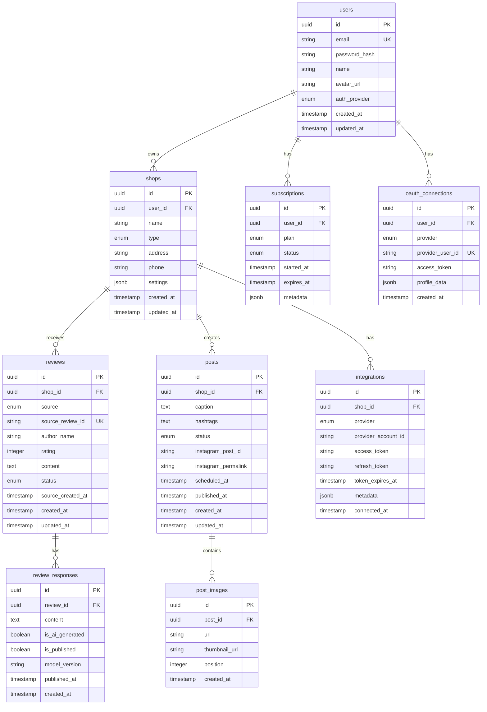

# 데이터 모델 (Data Model)

## 변경 이력

| 버전 | 날짜 | 작성자 | 변경 내용 |
|------|------|--------|----------|
| 1.0.0 | 2025-11-25 | @backend-lead | 최초 작성 |

## 관련 문서

- [ARCHITECTURE.md](./ARCHITECTURE.md) - 시스템 아키텍처
- [API_SPEC.md](./API_SPEC.md) - API 명세

---

## 1. ERD (Entity Relationship Diagram)



---

## 2. 테이블 상세 정의

### 2.1 users (사용자)

```sql
CREATE TABLE users (
    id UUID PRIMARY KEY DEFAULT gen_random_uuid(),
    email VARCHAR(255) NOT NULL UNIQUE,
    password_hash VARCHAR(255),
    name VARCHAR(100) NOT NULL,
    avatar_url VARCHAR(500),
    auth_provider VARCHAR(20) NOT NULL DEFAULT 'email',
    email_verified_at TIMESTAMPTZ,
    last_login_at TIMESTAMPTZ,
    created_at TIMESTAMPTZ NOT NULL DEFAULT NOW(),
    updated_at TIMESTAMPTZ NOT NULL DEFAULT NOW()
);

-- 인덱스
CREATE INDEX idx_users_email ON users(email);
CREATE INDEX idx_users_created_at ON users(created_at DESC);

-- 트리거: updated_at 자동 갱신
CREATE TRIGGER set_users_updated_at
    BEFORE UPDATE ON users
    FOR EACH ROW
    EXECUTE FUNCTION update_updated_at_column();
```

**필드 설명:**
| 필드 | 타입 | 설명 |
|------|------|------|
| id | UUID | 기본 키 |
| email | VARCHAR(255) | 이메일 (고유) |
| password_hash | VARCHAR(255) | bcrypt 해시 비밀번호 (OAuth 시 NULL) |
| name | VARCHAR(100) | 사용자 이름 |
| avatar_url | VARCHAR(500) | 프로필 이미지 URL |
| auth_provider | VARCHAR(20) | 인증 제공자 (email, google, kakao) |
| email_verified_at | TIMESTAMPTZ | 이메일 인증 완료 시간 |
| last_login_at | TIMESTAMPTZ | 마지막 로그인 시간 |

---

### 2.2 shops (매장)

```sql
CREATE TABLE shops (
    id UUID PRIMARY KEY DEFAULT gen_random_uuid(),
    user_id UUID NOT NULL REFERENCES users(id) ON DELETE CASCADE,
    name VARCHAR(100) NOT NULL,
    type VARCHAR(20) NOT NULL,
    address VARCHAR(500),
    phone VARCHAR(20),
    settings JSONB DEFAULT '{}',
    created_at TIMESTAMPTZ NOT NULL DEFAULT NOW(),
    updated_at TIMESTAMPTZ NOT NULL DEFAULT NOW()
);

-- 인덱스
CREATE INDEX idx_shops_user_id ON shops(user_id);

-- 제약 조건
ALTER TABLE shops ADD CONSTRAINT chk_shop_type
    CHECK (type IN ('nail', 'hair', 'skin', 'lash', 'other'));
```

**settings JSONB 구조:**
```json
{
  "reviewResponseTone": "friendly",
  "autoPublishReviews": false,
  "instagramAutoSchedule": true,
  "preferredPostingTimes": ["09:00", "18:00"],
  "hashtagPreferences": {
    "includeLocation": true,
    "maxCount": 25
  }
}
```

---

### 2.3 reviews (리뷰)

```sql
CREATE TABLE reviews (
    id UUID PRIMARY KEY DEFAULT gen_random_uuid(),
    shop_id UUID NOT NULL REFERENCES shops(id) ON DELETE CASCADE,
    source VARCHAR(20) NOT NULL,
    source_review_id VARCHAR(255) NOT NULL,
    author_name VARCHAR(100),
    author_profile_url VARCHAR(500),
    rating INTEGER NOT NULL,
    content TEXT,
    status VARCHAR(20) NOT NULL DEFAULT 'pending',
    source_created_at TIMESTAMPTZ,
    created_at TIMESTAMPTZ NOT NULL DEFAULT NOW(),
    updated_at TIMESTAMPTZ NOT NULL DEFAULT NOW(),

    UNIQUE(source, source_review_id)
);

-- 인덱스
CREATE INDEX idx_reviews_shop_id ON reviews(shop_id);
CREATE INDEX idx_reviews_shop_created ON reviews(shop_id, created_at DESC);
CREATE INDEX idx_reviews_status ON reviews(status) WHERE status = 'pending';
CREATE INDEX idx_reviews_source ON reviews(source);

-- 제약 조건
ALTER TABLE reviews ADD CONSTRAINT chk_review_source
    CHECK (source IN ('google', 'naver'));
ALTER TABLE reviews ADD CONSTRAINT chk_review_status
    CHECK (status IN ('pending', 'replied', 'skipped'));
ALTER TABLE reviews ADD CONSTRAINT chk_review_rating
    CHECK (rating >= 1 AND rating <= 5);
```

**필드 설명:**
| 필드 | 타입 | 설명 |
|------|------|------|
| source | VARCHAR(20) | 리뷰 출처 (google, naver) |
| source_review_id | VARCHAR(255) | 원본 플랫폼의 리뷰 ID |
| status | VARCHAR(20) | 상태 (pending, replied, skipped) |
| source_created_at | TIMESTAMPTZ | 원본 플랫폼에서의 작성 시간 |

---

### 2.4 review_responses (리뷰 답변)

```sql
CREATE TABLE review_responses (
    id UUID PRIMARY KEY DEFAULT gen_random_uuid(),
    review_id UUID NOT NULL REFERENCES reviews(id) ON DELETE CASCADE,
    content TEXT NOT NULL,
    is_ai_generated BOOLEAN NOT NULL DEFAULT true,
    is_published BOOLEAN NOT NULL DEFAULT false,
    model_version VARCHAR(50),
    published_at TIMESTAMPTZ,
    created_at TIMESTAMPTZ NOT NULL DEFAULT NOW()
);

-- 인덱스
CREATE INDEX idx_review_responses_review_id ON review_responses(review_id);
CREATE INDEX idx_review_responses_published ON review_responses(review_id)
    WHERE is_published = true;
```

---

### 2.5 posts (인스타그램 포스트)

```sql
CREATE TABLE posts (
    id UUID PRIMARY KEY DEFAULT gen_random_uuid(),
    shop_id UUID NOT NULL REFERENCES shops(id) ON DELETE CASCADE,
    caption TEXT,
    hashtags TEXT[],
    status VARCHAR(20) NOT NULL DEFAULT 'draft',
    instagram_post_id VARCHAR(100),
    instagram_permalink VARCHAR(500),
    scheduled_at TIMESTAMPTZ,
    published_at TIMESTAMPTZ,
    failed_reason TEXT,
    created_at TIMESTAMPTZ NOT NULL DEFAULT NOW(),
    updated_at TIMESTAMPTZ NOT NULL DEFAULT NOW()
);

-- 인덱스
CREATE INDEX idx_posts_shop_id ON posts(shop_id);
CREATE INDEX idx_posts_status ON posts(status);
CREATE INDEX idx_posts_scheduled ON posts(scheduled_at)
    WHERE status = 'scheduled' AND scheduled_at IS NOT NULL;

-- 제약 조건
ALTER TABLE posts ADD CONSTRAINT chk_post_status
    CHECK (status IN ('draft', 'scheduled', 'publishing', 'published', 'failed'));
```

---

### 2.6 post_images (포스트 이미지)

```sql
CREATE TABLE post_images (
    id UUID PRIMARY KEY DEFAULT gen_random_uuid(),
    post_id UUID NOT NULL REFERENCES posts(id) ON DELETE CASCADE,
    url VARCHAR(500) NOT NULL,
    thumbnail_url VARCHAR(500),
    width INTEGER,
    height INTEGER,
    size_bytes INTEGER,
    position INTEGER NOT NULL DEFAULT 0,
    created_at TIMESTAMPTZ NOT NULL DEFAULT NOW()
);

-- 인덱스
CREATE INDEX idx_post_images_post_id ON post_images(post_id);
```

---

### 2.7 subscriptions (구독)

```sql
CREATE TABLE subscriptions (
    id UUID PRIMARY KEY DEFAULT gen_random_uuid(),
    user_id UUID NOT NULL REFERENCES users(id) ON DELETE CASCADE,
    plan VARCHAR(20) NOT NULL,
    status VARCHAR(20) NOT NULL DEFAULT 'active',
    started_at TIMESTAMPTZ NOT NULL DEFAULT NOW(),
    expires_at TIMESTAMPTZ,
    cancelled_at TIMESTAMPTZ,
    payment_provider VARCHAR(20),
    payment_subscription_id VARCHAR(100),
    metadata JSONB DEFAULT '{}',
    created_at TIMESTAMPTZ NOT NULL DEFAULT NOW(),
    updated_at TIMESTAMPTZ NOT NULL DEFAULT NOW()
);

-- 인덱스
CREATE INDEX idx_subscriptions_user_id ON subscriptions(user_id);
CREATE INDEX idx_subscriptions_status ON subscriptions(status);
CREATE INDEX idx_subscriptions_expires ON subscriptions(expires_at)
    WHERE status = 'active';

-- 제약 조건
ALTER TABLE subscriptions ADD CONSTRAINT chk_subscription_plan
    CHECK (plan IN ('free', 'basic', 'pro', 'enterprise'));
ALTER TABLE subscriptions ADD CONSTRAINT chk_subscription_status
    CHECK (status IN ('active', 'cancelled', 'expired', 'past_due'));
```

---

### 2.8 integrations (외부 서비스 연동)

```sql
CREATE TABLE integrations (
    id UUID PRIMARY KEY DEFAULT gen_random_uuid(),
    shop_id UUID NOT NULL REFERENCES shops(id) ON DELETE CASCADE,
    provider VARCHAR(20) NOT NULL,
    provider_account_id VARCHAR(255) NOT NULL,
    provider_account_name VARCHAR(255),
    access_token TEXT NOT NULL,
    refresh_token TEXT,
    token_expires_at TIMESTAMPTZ,
    scopes TEXT[],
    metadata JSONB DEFAULT '{}',
    connected_at TIMESTAMPTZ NOT NULL DEFAULT NOW(),
    updated_at TIMESTAMPTZ NOT NULL DEFAULT NOW(),

    UNIQUE(shop_id, provider)
);

-- 인덱스
CREATE INDEX idx_integrations_shop_id ON integrations(shop_id);
CREATE INDEX idx_integrations_provider ON integrations(provider);

-- 제약 조건
ALTER TABLE integrations ADD CONSTRAINT chk_integration_provider
    CHECK (provider IN ('google_business', 'instagram'));
```

---

### 2.9 oauth_connections (OAuth 연결)

```sql
CREATE TABLE oauth_connections (
    id UUID PRIMARY KEY DEFAULT gen_random_uuid(),
    user_id UUID NOT NULL REFERENCES users(id) ON DELETE CASCADE,
    provider VARCHAR(20) NOT NULL,
    provider_user_id VARCHAR(255) NOT NULL,
    access_token TEXT,
    refresh_token TEXT,
    profile_data JSONB,
    created_at TIMESTAMPTZ NOT NULL DEFAULT NOW(),
    updated_at TIMESTAMPTZ NOT NULL DEFAULT NOW(),

    UNIQUE(provider, provider_user_id)
);

-- 인덱스
CREATE INDEX idx_oauth_connections_user_id ON oauth_connections(user_id);
CREATE INDEX idx_oauth_connections_provider ON oauth_connections(provider, provider_user_id);
```

---

## 3. SQLAlchemy 모델

### 3.1 User 모델

```python
from sqlalchemy import Column, String, DateTime, Enum
from sqlalchemy.dialects.postgresql import UUID
from sqlalchemy.orm import relationship
import uuid
from datetime import datetime

from .base import Base


class User(Base):
    """사용자 엔티티"""

    __tablename__ = "users"

    id = Column(UUID(as_uuid=True), primary_key=True, default=uuid.uuid4)
    email = Column(String(255), unique=True, nullable=False, index=True)
    password_hash = Column(String(255), nullable=True)
    name = Column(String(100), nullable=False)
    avatar_url = Column(String(500), nullable=True)
    auth_provider = Column(
        String(20),
        nullable=False,
        default="email"
    )
    email_verified_at = Column(DateTime(timezone=True), nullable=True)
    last_login_at = Column(DateTime(timezone=True), nullable=True)
    created_at = Column(
        DateTime(timezone=True),
        nullable=False,
        default=datetime.utcnow
    )
    updated_at = Column(
        DateTime(timezone=True),
        nullable=False,
        default=datetime.utcnow,
        onupdate=datetime.utcnow
    )

    # 관계
    shops = relationship("Shop", back_populates="owner", cascade="all, delete-orphan")
    subscriptions = relationship("Subscription", back_populates="user")
    oauth_connections = relationship("OAuthConnection", back_populates="user")

    def __repr__(self):
        return f"<User {self.email}>"
```

### 3.2 Review 모델

```python
from sqlalchemy import Column, String, Integer, Text, DateTime, ForeignKey
from sqlalchemy.dialects.postgresql import UUID
from sqlalchemy.orm import relationship
import uuid
from datetime import datetime

from .base import Base


class Review(Base):
    """리뷰 엔티티"""

    __tablename__ = "reviews"

    id = Column(UUID(as_uuid=True), primary_key=True, default=uuid.uuid4)
    shop_id = Column(
        UUID(as_uuid=True),
        ForeignKey("shops.id", ondelete="CASCADE"),
        nullable=False,
        index=True
    )
    source = Column(String(20), nullable=False)
    source_review_id = Column(String(255), nullable=False)
    author_name = Column(String(100), nullable=True)
    author_profile_url = Column(String(500), nullable=True)
    rating = Column(Integer, nullable=False)
    content = Column(Text, nullable=True)
    status = Column(String(20), nullable=False, default="pending")
    source_created_at = Column(DateTime(timezone=True), nullable=True)
    created_at = Column(
        DateTime(timezone=True),
        nullable=False,
        default=datetime.utcnow
    )
    updated_at = Column(
        DateTime(timezone=True),
        nullable=False,
        default=datetime.utcnow,
        onupdate=datetime.utcnow
    )

    # 복합 유니크 제약
    __table_args__ = (
        UniqueConstraint('source', 'source_review_id', name='uq_review_source'),
    )

    # 관계
    shop = relationship("Shop", back_populates="reviews")
    responses = relationship(
        "ReviewResponse",
        back_populates="review",
        cascade="all, delete-orphan"
    )

    @property
    def is_positive(self) -> bool:
        """긍정 리뷰 여부 (4점 이상)"""
        return self.rating >= 4

    @property
    def latest_response(self):
        """가장 최근 답변"""
        if not self.responses:
            return None
        return max(self.responses, key=lambda r: r.created_at)
```

---

## 4. Pydantic 스키마

### 4.1 Review 스키마

```python
from pydantic import BaseModel, Field
from datetime import datetime
from typing import Optional, List
from uuid import UUID


class ReviewResponseSchema(BaseModel):
    """리뷰 답변 스키마"""

    content: str
    is_ai_generated: bool
    is_published: bool
    published_at: Optional[datetime] = None
    created_at: datetime

    class Config:
        from_attributes = True


class ReviewSchema(BaseModel):
    """리뷰 스키마"""

    id: UUID
    source: str
    author_name: Optional[str] = None
    rating: int = Field(ge=1, le=5)
    content: Optional[str] = None
    status: str
    ai_response: Optional[ReviewResponseSchema] = None
    published_response: Optional[ReviewResponseSchema] = None
    created_at: datetime

    class Config:
        from_attributes = True


class ReviewListResponse(BaseModel):
    """리뷰 목록 응답"""

    data: List[ReviewSchema]
    pagination: PaginationSchema


class GenerateResponseRequest(BaseModel):
    """AI 답변 생성 요청"""

    tone: str = Field(default="friendly", pattern="^(friendly|professional|casual)$")
    custom_instructions: Optional[str] = Field(default=None, max_length=200)


class PublishResponseRequest(BaseModel):
    """답변 게시 요청"""

    content: str = Field(min_length=20, max_length=500)
```

---

## 5. 마이그레이션

### 5.1 초기 마이그레이션

```python
# alembic/versions/001_initial.py

"""Initial migration

Revision ID: 001
Create Date: 2025-11-25
"""

from alembic import op
import sqlalchemy as sa
from sqlalchemy.dialects import postgresql

revision = '001'
down_revision = None


def upgrade():
    # updated_at 자동 갱신 함수
    op.execute("""
        CREATE OR REPLACE FUNCTION update_updated_at_column()
        RETURNS TRIGGER AS $$
        BEGIN
            NEW.updated_at = NOW();
            RETURN NEW;
        END;
        $$ language 'plpgsql';
    """)

    # users 테이블
    op.create_table(
        'users',
        sa.Column('id', postgresql.UUID(as_uuid=True), primary_key=True),
        sa.Column('email', sa.String(255), nullable=False, unique=True),
        sa.Column('password_hash', sa.String(255), nullable=True),
        sa.Column('name', sa.String(100), nullable=False),
        sa.Column('avatar_url', sa.String(500), nullable=True),
        sa.Column('auth_provider', sa.String(20), nullable=False, default='email'),
        sa.Column('email_verified_at', sa.DateTime(timezone=True), nullable=True),
        sa.Column('last_login_at', sa.DateTime(timezone=True), nullable=True),
        sa.Column('created_at', sa.DateTime(timezone=True), nullable=False),
        sa.Column('updated_at', sa.DateTime(timezone=True), nullable=False),
    )

    # ... 나머지 테이블들


def downgrade():
    op.drop_table('users')
    # ... 나머지 테이블들
    op.execute("DROP FUNCTION IF EXISTS update_updated_at_column()")
```

---

## 6. Row Level Security (RLS)

Supabase RLS 정책:

```sql
-- users 테이블
ALTER TABLE users ENABLE ROW LEVEL SECURITY;

CREATE POLICY "Users can view own profile"
    ON users FOR SELECT
    USING (auth.uid() = id);

CREATE POLICY "Users can update own profile"
    ON users FOR UPDATE
    USING (auth.uid() = id);

-- shops 테이블
ALTER TABLE shops ENABLE ROW LEVEL SECURITY;

CREATE POLICY "Users can view own shops"
    ON shops FOR SELECT
    USING (user_id = auth.uid());

CREATE POLICY "Users can manage own shops"
    ON shops FOR ALL
    USING (user_id = auth.uid());

-- reviews 테이블
ALTER TABLE reviews ENABLE ROW LEVEL SECURITY;

CREATE POLICY "Users can view reviews for own shops"
    ON reviews FOR SELECT
    USING (
        shop_id IN (
            SELECT id FROM shops WHERE user_id = auth.uid()
        )
    );
```

---

## 7. 데이터 백업 및 복구

### 7.1 백업 전략

| 유형 | 주기 | 보관 기간 |
|------|------|----------|
| Full Backup | 일 1회 | 30일 |
| Point-in-Time | 연속 (WAL) | 7일 |
| Snapshot | 주 1회 | 90일 |

### 7.2 복구 절차

```bash
# Supabase CLI를 통한 복구
supabase db restore --time "2025-11-24T10:00:00Z"

# 또는 특정 백업에서 복구
supabase db restore --backup-id backup_abc123
```

---

*이 문서는 스키마 변경에 따라 지속적으로 업데이트됩니다.*
