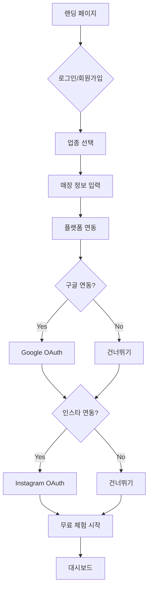
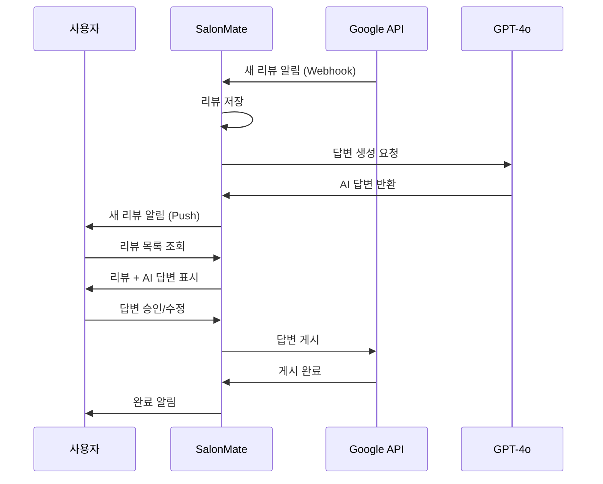

# 제품 요구사항 문서 (PRD)

## 변경 이력

| 버전 | 날짜 | 작성자 | 변경 내용 |
|------|------|--------|----------|
| 1.0.0 | 2025-11-25 | @product-owner | 최초 작성 |

## 관련 문서

- [CONTEXT.md](../../CONTEXT.md) - 프로젝트 컨텍스트
- [ARCHITECTURE.md](./ARCHITECTURE.md) - 시스템 아키텍처
- [API_SPEC.md](./API_SPEC.md) - API 명세

---

## 1. 제품 개요

### 1.1 제품명
**SalonMate (살롱메이트)**

### 1.2 비전
> 뷰티샵 사장님이 시술에만 집중할 수 있도록, 마케팅은 AI가 대신합니다.

### 1.3 미션
뷰티 업종 소상공인의 디지털 마케팅 진입 장벽을 낮추고, AI 자동화를 통해 마케팅 효율을 극대화합니다.

### 1.4 목표 지표 (North Star Metrics)

| 지표 | 정의 | 6개월 목표 |
|------|------|-----------|
| **활성 구독자 수** | 월 1회 이상 서비스 사용 유료 고객 | 100개 |
| **월간 반복 매출 (MRR)** | 월별 구독 매출 합계 | 1,000만원 |
| **AI 답변 채택률** | AI 생성 답변 중 수정 없이 사용된 비율 | 70% |
| **콘텐츠 생산량 증가율** | 서비스 도입 후 월간 포스팅 증가율 | 3배 |

---

## 2. 타겟 사용자

### 2.1 주요 페르소나

```
┌─────────────────────────────────────────────────────────────────┐
│  페르소나 1: 김미영 (1인 네일샵 원장)                              │
├─────────────────────────────────────────────────────────────────┤
│  나이: 32세                                                      │
│  경력: 네일아티스트 8년, 창업 2년차                                │
│  매장: 강남역 근처 15평 네일샵                                     │
│  월매출: 800만원                                                 │
│  마케팅 예산: 월 30만원                                           │
├─────────────────────────────────────────────────────────────────┤
│  Pain Points:                                                    │
│  • 하루 10개 이상 리뷰에 답변하느라 30분 이상 소요                   │
│  • 시술 사진은 많이 찍지만 인스타 업로드는 월 2-3회뿐                 │
│  • 블로그 대행 비용 월 25만원이 부담됨                              │
│  • 효과적인 해시태그를 모르겠음                                     │
├─────────────────────────────────────────────────────────────────┤
│  Goals:                                                          │
│  • 리뷰 답변 시간 5분 이내로 단축                                   │
│  • 인스타 포스팅 주 3회 이상                                       │
│  • 마케팅 비용 50% 절감                                           │
│  • 신규 고객 월 20% 증가                                          │
└─────────────────────────────────────────────────────────────────┘
```

```
┌─────────────────────────────────────────────────────────────────┐
│  페르소나 2: 박준호 (헤어샵 점장)                                   │
├─────────────────────────────────────────────────────────────────┤
│  나이: 38세                                                      │
│  경력: 헤어디자이너 15년, 점장 3년차                                │
│  매장: 홍대 30평 헤어샵 (직원 5명)                                  │
│  월매출: 4,000만원                                               │
│  마케팅 예산: 월 100만원                                          │
├─────────────────────────────────────────────────────────────────┤
│  Pain Points:                                                    │
│  • 직원들의 SNS 마케팅 교육이 어려움                                │
│  • 네이버/구글 리뷰 관리가 체계적이지 않음                           │
│  • 마케팅 성과 측정이 어려움                                       │
│  • 외국인 고객 리뷰 대응이 어려움 (영어/중국어)                       │
├─────────────────────────────────────────────────────────────────┤
│  Goals:                                                          │
│  • 통합된 리뷰 관리 시스템                                         │
│  • 직원별 콘텐츠 생성 지원                                         │
│  • 마케팅 ROI 가시화                                              │
│  • 다국어 리뷰 대응                                               │
└─────────────────────────────────────────────────────────────────┘
```

### 2.2 사용자 세그먼트

| 세그먼트 | 특징 | 비율 | 주요 니즈 |
|---------|------|------|----------|
| 1인 샵 | 직원 없음, 예산 제한 | 60% | 시간 절약, 비용 절감 |
| 소규모 샵 | 직원 2-5명 | 30% | 통합 관리, 팀 협업 |
| 중규모 샵 | 직원 6-15명, 다지점 | 10% | 분석, 브랜딩 |

---

## 3. 기능 요구사항

### 3.1 기능 우선순위 매트릭스

```
                    높음
                     │
        P0: MVP      │      P1: 확장
    ┌────────────────┼────────────────┐
    │ • 구글 리뷰 답변  │ • 인스타 예약발행  │
    │ • 네이버 답변 생성│ • 대시보드       │
    │ • 캡션/해시태그  │ • 포스팅 통계    │
 영 │                │                │ 빈
 향 ├────────────────┼────────────────┤ 도
 도 │ P2: 개선       │      P3: 나중에   │
    │ • 다국어 답변    │ • 블로그 자동화   │
    │ • 톤 커스터마이징 │ • CRM 연동      │
    │ • 벌크 답변     │ • 예약 연동      │
    └────────────────┴────────────────┘
                    낮음
            ◀─────────────────────────▶
              구현 난이도 (낮음 → 높음)
```

### 3.2 MVP 기능 상세 (P0)

#### FR-001: 사용자 인증

| 항목 | 내용 |
|------|------|
| **기능 ID** | FR-001 |
| **기능명** | 사용자 인증 |
| **설명** | 이메일, 구글, 카카오 로그인 지원 |
| **우선순위** | P0 |

**상세 요구사항:**
- FR-001-1: 이메일/비밀번호 회원가입
- FR-001-2: 이메일/비밀번호 로그인
- FR-001-3: 구글 OAuth 2.0 로그인
- FR-001-4: 카카오 OAuth 2.0 로그인
- FR-001-5: 비밀번호 재설정 (이메일)
- FR-001-6: JWT 토큰 갱신

**인수 조건:**
```gherkin
Feature: 사용자 로그인
  Scenario: 이메일로 로그인
    Given 등록된 사용자가 있을 때
    When 올바른 이메일과 비밀번호로 로그인하면
    Then 액세스 토큰을 발급받는다
    And 대시보드로 리다이렉트된다

  Scenario: 잘못된 비밀번호
    Given 등록된 사용자가 있을 때
    When 잘못된 비밀번호로 로그인하면
    Then "이메일 또는 비밀번호가 올바르지 않습니다" 에러가 표시된다
```

---

#### FR-002: 구글 리뷰 자동 답변

| 항목 | 내용 |
|------|------|
| **기능 ID** | FR-002 |
| **기능명** | 구글 리뷰 자동 답변 |
| **설명** | Google Business Profile 리뷰에 AI 답변 자동 생성 및 게시 |
| **우선순위** | P0 |

**상세 요구사항:**
- FR-002-1: Google Business Profile 계정 연동
- FR-002-2: 리뷰 목록 자동 동기화 (15분 주기)
- FR-002-3: AI 답변 자동 생성
- FR-002-4: 답변 편집 기능
- FR-002-5: 답변 자동 게시 (승인 후)
- FR-002-6: 답변 이력 조회

**비즈니스 규칙:**
| 규칙 ID | 규칙 | 설명 |
|---------|------|------|
| BR-002-1 | 답변 길이 | 50~500자 |
| BR-002-2 | 응답 시간 | 리뷰 수신 후 1시간 이내 답변 생성 |
| BR-002-3 | 부정 리뷰 | 별점 3점 이하는 공감 + 해결 의지 표현 |
| BR-002-4 | 긍정 리뷰 | 별점 4점 이상은 감사 + 재방문 유도 |

**인수 조건:**
```gherkin
Feature: 구글 리뷰 AI 답변
  Scenario: 긍정 리뷰 답변 생성
    Given 별점 5점 리뷰가 수신되면
    When AI 답변 생성을 실행하면
    Then 감사 표현이 포함된 답변이 생성된다
    And 재방문 유도 문구가 포함된다
    And 답변 길이는 50~500자이다

  Scenario: 부정 리뷰 답변 생성
    Given 별점 2점 리뷰가 수신되면
    When AI 답변 생성을 실행하면
    Then 공감 표현이 포함된 답변이 생성된다
    And 개선 약속 문구가 포함된다
    And 연락처 안내가 포함된다
```

**UI 와이어프레임:**
```
┌─────────────────────────────────────────────────────────────────┐
│  리뷰 관리                                      [동기화] [설정]  │
├─────────────────────────────────────────────────────────────────┤
│  ┌─────────────────────────────────────────────────────────────┐│
│  │ ⭐⭐⭐⭐⭐  김**  •  1시간 전  •  Google                    ││
│  │ "네일 너무 예뻐요! 디자이너님 손재주가 정말 좋으세요~"        ││
│  ├─────────────────────────────────────────────────────────────┤│
│  │ 🤖 AI 추천 답변:                                           ││
│  │ ┌───────────────────────────────────────────────────────┐  ││
│  │ │ 김** 고객님, 따뜻한 리뷰 감사드립니다! 예쁘게 봐주셔서   │  ││
│  │ │ 정말 기뻐요. 다음에도 더 예쁜 디자인으로 찾아뵐게요.    │  ││
│  │ │ 또 만나요! 💅                                         │  ││
│  │ └───────────────────────────────────────────────────────┘  ││
│  │                              [수정하기] [바로 게시] [건너뛰기]││
│  └─────────────────────────────────────────────────────────────┘│
│                                                                 │
│  ┌─────────────────────────────────────────────────────────────┐│
│  │ ⭐⭐  박**  •  3시간 전  •  Google                         ││
│  │ "예약 시간에 갔는데 30분이나 기다렸어요. 좀 아쉽네요."        ││
│  └─────────────────────────────────────────────────────────────┘│
└─────────────────────────────────────────────────────────────────┘
```

---

#### FR-003: 네이버 리뷰 답변 생성

| 항목 | 내용 |
|------|------|
| **기능 ID** | FR-003 |
| **기능명** | 네이버 리뷰 답변 생성 |
| **설명** | 네이버 플레이스 리뷰에 대한 AI 답변 생성 (수동 게시) |
| **우선순위** | P0 |

**상세 요구사항:**
- FR-003-1: 리뷰 내용 직접 입력 (복사/붙여넣기)
- FR-003-2: AI 답변 생성
- FR-003-3: 답변 복사 버튼
- FR-003-4: 답변 이력 저장

**참고:** 네이버 플레이스는 공식 API가 없어 자동 게시 불가. 사용자가 복사하여 네이버에 직접 게시.

---

#### FR-004: 인스타그램 콘텐츠 생성

| 항목 | 내용 |
|------|------|
| **기능 ID** | FR-004 |
| **기능명** | 인스타그램 콘텐츠 생성 |
| **설명** | 시술 사진으로 캡션 및 해시태그 자동 생성 |
| **우선순위** | P0 |

**상세 요구사항:**
- FR-004-1: 이미지 업로드 (최대 10장)
- FR-004-2: 시술 정보 입력 (시술명, 컬러, 특징)
- FR-004-3: AI 캡션 생성
- FR-004-4: AI 해시태그 추천 (최대 30개)
- FR-004-5: 캡션/해시태그 편집
- FR-004-6: 콘텐츠 저장 (포스팅 연동 전)

**비즈니스 규칙:**
| 규칙 ID | 규칙 | 설명 |
|---------|------|------|
| BR-004-1 | 캡션 길이 | 100~500자 권장 |
| BR-004-2 | 해시태그 수 | 15~25개 권장 |
| BR-004-3 | 해시태그 구성 | 지역 30% + 시술 40% + 트렌드 30% |
| BR-004-4 | CTA 포함 | 예약 유도 문구 필수 포함 |

**UI 와이어프레임:**
```
┌─────────────────────────────────────────────────────────────────┐
│  인스타 포스트 만들기                               [저장] [발행] │
├─────────────────────────────────────────────────────────────────┤
│  ┌──────────────────────┐  ┌────────────────────────────────┐  │
│  │                      │  │ 시술 정보                      │  │
│  │    📷 이미지 추가     │  │ ┌────────────────────────────┐│  │
│  │    (최대 10장)       │  │ │ 시술명: 글리터 네일         ││  │
│  │                      │  │ └────────────────────────────┘│  │
│  │  [+] 이미지 선택     │  │ ┌────────────────────────────┐│  │
│  │                      │  │ │ 컬러: 핑크, 골드           ││  │
│  └──────────────────────┘  │ └────────────────────────────┘│  │
│                            │ ┌────────────────────────────┐│  │
│                            │ │ 특징: 크리스마스 시즌 아트   ││  │
│                            │ └────────────────────────────┘│  │
│                            │                  [AI 생성하기] │  │
│                            └────────────────────────────────┘  │
│                                                                 │
│  ┌─────────────────────────────────────────────────────────────┐│
│  │ 📝 캡션                                         [재생성] 🔄 ││
│  │ ┌───────────────────────────────────────────────────────┐  ││
│  │ │ ✨ 크리스마스 글리터 네일 ✨                           │  ││
│  │ │                                                       │  ││
│  │ │ 핑크와 골드의 조합으로 화려하면서도 우아한 느낌!        │  ││
│  │ │ 파티 시즌에 딱 어울리는 디자인이에요 💅                │  ││
│  │ │                                                       │  ││
│  │ │ 💌 예약 문의: 프로필 링크 또는 DM                      │  ││
│  │ └───────────────────────────────────────────────────────┘  ││
│  └─────────────────────────────────────────────────────────────┘│
│                                                                 │
│  ┌─────────────────────────────────────────────────────────────┐│
│  │ #️⃣ 해시태그                               [추가] [재생성]  ││
│  │ #강남네일 #글리터네일 #크리스마스네일 #네일아트             ││
│  │ #파티네일 #젤네일 #핑크네일 #골드네일 #윈터네일             ││
│  │ #네일디자인 #네일스타그램 #네일샵추천 #강남네일샵           ││
│  └─────────────────────────────────────────────────────────────┘│
└─────────────────────────────────────────────────────────────────┘
```

---

### 3.3 P1 기능 상세

#### FR-005: 인스타그램 예약 발행

| 항목 | 내용 |
|------|------|
| **기능 ID** | FR-005 |
| **기능명** | 인스타그램 예약 발행 |
| **설명** | Instagram Graph API 연동으로 예약 포스팅 |
| **우선순위** | P1 |

**상세 요구사항:**
- FR-005-1: Instagram Business 계정 연동
- FR-005-2: 예약 시간 설정
- FR-005-3: 예약 게시물 관리 (수정/취소)
- FR-005-4: 발행 완료 알림

---

#### FR-006: 대시보드

| 항목 | 내용 |
|------|------|
| **기능 ID** | FR-006 |
| **기능명** | 대시보드 |
| **설명** | 리뷰 및 포스팅 현황 종합 대시보드 |
| **우선순위** | P1 |

**상세 요구사항:**
- FR-006-1: 이번 주 리뷰 수 / 답변율
- FR-006-2: 이번 달 포스팅 수
- FR-006-3: 평균 평점 추이
- FR-006-4: 최근 리뷰 목록 (5개)

---

## 4. 비기능 요구사항

### 4.1 성능 요구사항

| 항목 | 요구사항 | 측정 방법 |
|------|---------|----------|
| 페이지 로드 | < 3초 (LCP) | Lighthouse |
| API 응답 | < 500ms (p95) | APM |
| AI 생성 | < 10초 | 로그 분석 |
| 동시 사용자 | 1,000명 | 부하 테스트 |

### 4.2 가용성 요구사항

| 항목 | 요구사항 |
|------|---------|
| 서비스 가용성 | 99.5% (월간) |
| 계획 유지보수 | 월 1회, 4시간 이내 |
| 장애 복구 시간 | < 1시간 |
| 데이터 백업 | 일 1회, 30일 보관 |

### 4.3 보안 요구사항

| 항목 | 요구사항 |
|------|---------|
| 데이터 암호화 | TLS 1.3 (전송), AES-256 (저장) |
| 인증 | JWT + Refresh Token |
| 비밀번호 | bcrypt 해시, 최소 8자 |
| 세션 | 30분 만료, 갱신 가능 |
| 개인정보 | 개인정보보호법 준수 |

### 4.4 접근성 요구사항

| 항목 | 요구사항 |
|------|---------|
| WCAG | 레벨 AA 준수 |
| 키보드 | 전체 기능 키보드 접근 가능 |
| 스크린리더 | 주요 기능 호환 |
| 색상 대비 | 4.5:1 이상 |

---

## 5. 사용자 플로우

### 5.1 온보딩 플로우



### 5.2 리뷰 답변 플로우



---

## 6. 릴리스 계획

### 6.1 MVP 릴리스 (v1.0)

**목표 일정:** 개발 시작 후 8주

| 주차 | 마일스톤 | 산출물 |
|------|---------|--------|
| 1-2 | 설계 완료 | 기술 문서, 디자인 |
| 3-4 | 인프라 & 인증 | 로그인, DB 설정 |
| 5-6 | 핵심 기능 | 리뷰 답변, 콘텐츠 생성 |
| 7 | QA & 버그픽스 | 테스트 완료 |
| 8 | 소프트 런칭 | 베타 사용자 10명 |

### 6.2 v1.1 릴리스

**목표 일정:** MVP 후 4주

- 인스타그램 예약 발행
- 대시보드 고도화
- 다국어 답변 지원

### 6.3 v1.2 릴리스

**목표 일정:** v1.1 후 4주

- 톤/스타일 커스터마이징
- 벌크 답변 처리
- 포스팅 통계 분석

---

## 7. 성공 지표

### 7.1 사용자 행동 지표

| 지표 | 정의 | 목표 |
|------|------|------|
| 가입 완료율 | 가입 시작 → 완료 | 70% |
| 온보딩 완료율 | 가입 → 첫 연동 | 60% |
| D1 리텐션 | 다음 날 재방문 | 50% |
| D7 리텐션 | 7일 후 재방문 | 30% |
| WAU/MAU | 주간/월간 활성 비율 | 60% |

### 7.2 비즈니스 지표

| 지표 | 정의 | 목표 |
|------|------|------|
| Trial→Paid | 무료→유료 전환 | 30% |
| 월 이탈률 | 유료 고객 이탈 | < 10% |
| ARPU | 사용자당 평균 매출 | 10만원 |
| LTV | 고객 생애 가치 | 100만원 |
| CAC | 고객 획득 비용 | < 30만원 |

### 7.3 제품 품질 지표

| 지표 | 정의 | 목표 |
|------|------|------|
| NPS | 순추천지수 | 40+ |
| AI 채택률 | 수정 없이 사용 | 70% |
| 에러율 | 요청당 에러 | < 0.1% |
| 응답 시간 | API p95 | < 500ms |

---

## 8. 리스크 및 의존성

### 8.1 리스크

| 리스크 | 확률 | 영향 | 대응 |
|--------|------|------|------|
| 네이버 API 제공 | 낮 | 높 | 수동 워크플로우 유지 |
| OpenAI 비용 급증 | 중 | 중 | 캐싱, 모델 전환 |
| 구글 API 정책 변경 | 낮 | 높 | 모니터링, 대체 방안 |
| 경쟁사 진입 | 중 | 중 | 버티컬 특화 |

### 8.2 의존성

| 의존성 | 제공자 | 중요도 |
|--------|--------|--------|
| Google Business Profile API | Google | 필수 |
| Instagram Graph API | Meta | 필수 |
| OpenAI GPT-4o | OpenAI | 필수 |
| Supabase | Supabase | 필수 |

---

*이 문서는 프로젝트 진행에 따라 지속적으로 업데이트됩니다.*
